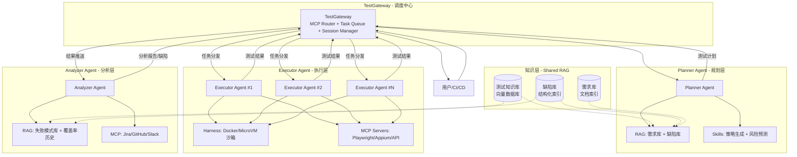
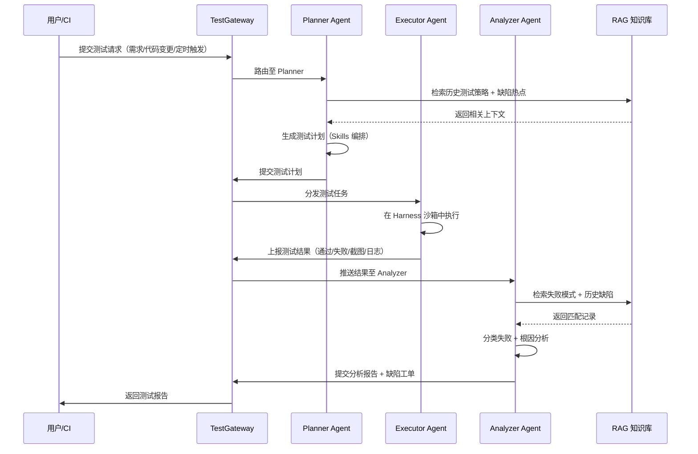
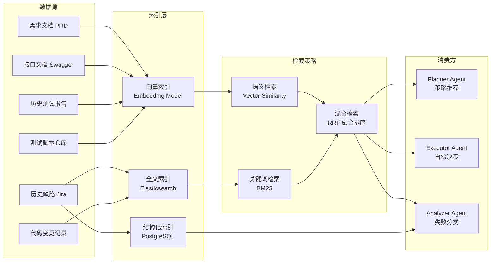
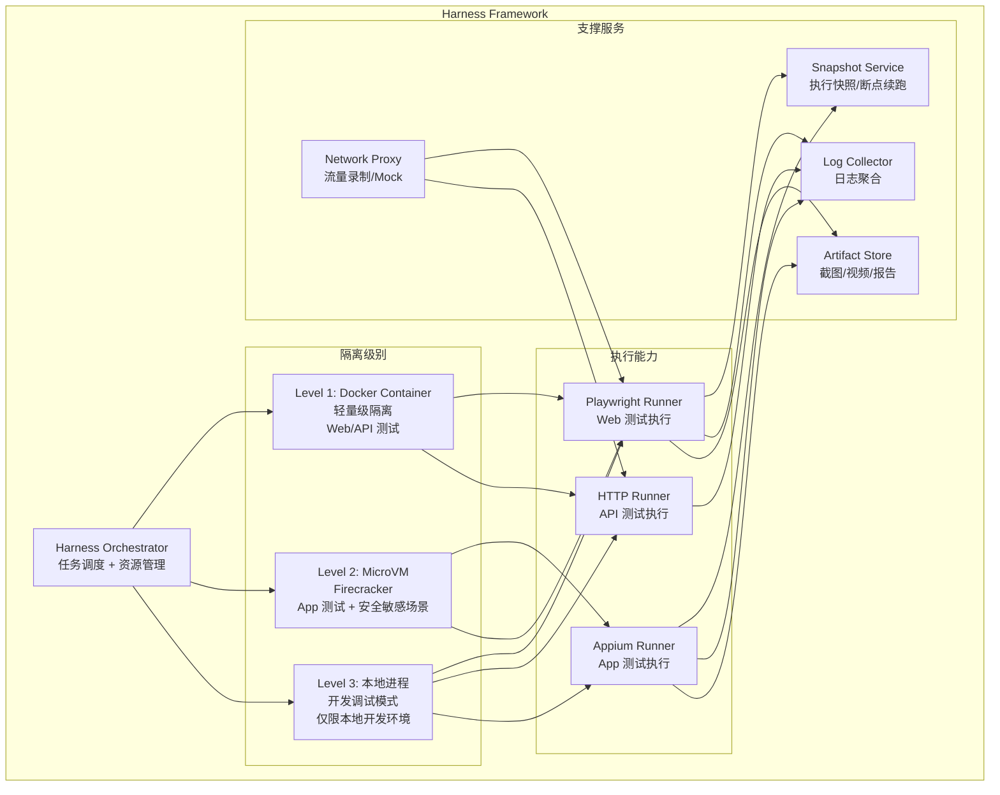
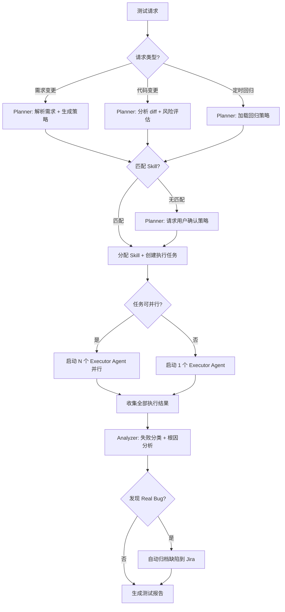
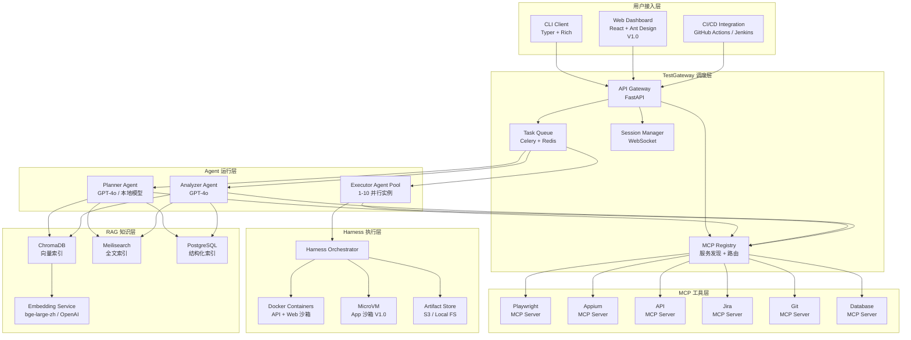
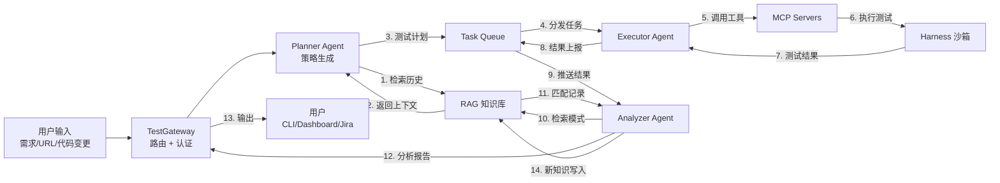

# TestAgent 产品需求文档（PRD）

> **文档版本**：v1.0  
> **撰写日期**：2026-04-26  
> **文档状态**：待评审  
> **目标里程碑**：MVP 上线（3 个月交付）

---

## 1. 产品概述

### 1.1 产品愿景与定位

**愿景**：成为软件测试领域的"自动驾驶系统"——让 AI Agent 自主完成从测试规划到缺陷管理的全链路工作，将测试工程师从脚本维护中解放，转变为"测试智能体编排师"。

**定位**：TestAgent 是一款面向 App（iOS/Android）/ Web / API 全平台的 AI 测试智能体平台，通过多 Agent 协作架构、MCP 工具调用、RAG 知识检索、Skills 技能编排和 Harness 沙箱执行引擎，实现测试全生命周期的自主化与智能化。

### 1.2 目标用户画像

| 维度 | 用户 A：QA 工程师 | 用户 B：测试主管 / QA Lead | 用户 C：开发工程师 |
|------|-------------------|---------------------------|-------------------|
| **典型特征** | 2-5 年经验，熟悉 Selenium/Appium，每天维护脚本 | 5-10 年经验，管理 3-10 人团队，关注覆盖率和交付质量 | 全栈开发者，写单元测试但不愿花时间写 E2E 测试 |
| **核心痛点** | 脚本维护占 60% 工时；UI 变更导致批量失败；断言编写低效 | 团队人力有限无法覆盖所有场景；回归测试周期长；缺乏量化质量指标 | 手动测试 API 耗时；E2E 测试编写门槛高；测试反馈慢 |
| **使用场景** | 日常回归测试、冒烟测试、UI 变更后的自愈修复 | 制定测试策略、监控质量趋势、CI/CD 质量门禁 | 本地开发时快速验证 API、提交 PR 时触发增量测试 |
| **技能水平** | 中等编程能力，熟悉测试框架 | 战略视角，需要 Dashboard 级可视化 | 高编程能力，偏好 CLI 和自动化 |
| **期望价值** | 减少 70% 脚本维护时间，聚焦探索性测试 | 可视化覆盖率提升 30%，回归周期缩短 50% | 开发-测试反馈循环从小时级降至分钟级 |

### 1.3 核心价值主张

> **TestAgent = 全链路自主测试 + 知识驱动 + 沙箱安全执行。**  
> 与现有工具仅解决"脚本维护"或"自然语言编写"不同，TestAgent 通过多 Agent 协作实现从需求理解到缺陷归档的端到端自动化，并通过 RAG 知识检索让每次测试都"站在历史的肩膀上"——越用越聪明。

### 1.4 对标分析与差异化

#### 1.4.1 对标 Claude Code：Agent 编排与 Skills 机制

**借鉴**：
- **Agent 编排模式**：Claude Code 采用主 Agent + SubAgent 架构，主 Agent 负责任务分解与编排，SubAgent 在独立上下文中执行子任务。TestAgent 借鉴此模式设计 Planner Agent（规划）→ Executor Agent（执行）→ Analyzer Agent（分析）的三层协作架构，每个 Agent 拥有独立的工具集和上下文窗口，通过结构化消息协议通信。
- **Skills 机制**：Claude Code 的 Skills 是一种"教 Agent 如何使用工具的上下文模板"，将 MCP 连接（能力）与操作流程（知识）绑定。TestAgent 直接采用此设计理念：一个"冒烟测试 Skill"不仅包含可调用的工具列表，还定义了冒烟测试的操作步骤、断言策略、优先级规则。
- **CLI 交互模式**：Claude Code 的终端交互模式深得开发者青睐，TestAgent MVP 阶段同样以 CLI 为主要交互入口。

**改进**：
- Claude Code 的 SubAgent 通过 tmux 通信存在终端渲染问题（[GitHub Issue #14109](https://github.com/anthropics/claude-code/issues/14109)），TestAgent 改用 MCP 协议作为 Agent 间通信标准，实现结构化消息路由，避免文本解析的脆弱性。
- Claude Code 缺乏领域知识检索机制，SubAgent 每次执行都从零开始。TestAgent 引入 RAG 层，Agent 可检索历史测试策略、缺陷库、需求变更记录，实现上下文积累。
- Claude Code 的 Skills 面向通用编码场景，TestAgent 的 Skills 面向测试领域深度定制，每个 Skill 内置测试特定的决策树（如"API 测试 Skill"自动判断 HTTP 方法、参数组合、边界值策略）。

#### 1.4.2 对标 OpenClaw：Gateway 架构与记忆系统

**借鉴**：
- **Gateway 中心化架构**：OpenClaw 的 Gateway 是所有消息、工具调用、记忆检索的枢纽，通过 WebSocket 实现全双工通信。TestAgent 借鉴此设计，构建 TestGateway 作为测试任务调度中心，统一管理 MCP Server 注册、Agent 会话路由、执行资源分配。
- **RAG 记忆系统**：OpenClaw 的 QMD（Query Memory Database）实现了向量 + 关键词的混合检索，支持跨会话上下文保持。TestAgent 将此模式应用于测试知识库，检索历史缺陷模式、历史测试策略效果、需求变更影响面。
- **Skills 的 Markdown 定义**：OpenClaw 用 Markdown 文件定义 Skills（AGENTS.md / TOOLS.md / SOUL.md），支持用户自定义和版本管理。TestAgent 采用相同格式定义测试 Skills，方便 Git 管理和团队协作。
- **三层隔离执行**：OpenClaw 的安全 Shell 执行机制（容器 / 虚拟机 / 宿主三层），TestAgent 将此扩展为 Harness 沙箱框架，专门针对测试执行场景做隔离强化。

**改进**：
- OpenClaw 是通用 AI Agent 框架，缺乏测试领域原语（如测试用例、断言、覆盖率）。TestAgent 在 Agent Runtime 中内置测试领域模型，Agent 天然理解"测试计划""用例""缺陷"等概念。
- OpenClaw 的记忆检索缺乏领域结构化（纯文本记忆）。TestAgent 的 RAG 系统针对测试场景建立结构化索引：缺陷严重度、模块归属、出现频率、修复耗时等多维标签。
- OpenClaw 面向单用户个人助手场景。TestAgent 需支持团队级协作（多人同时提交测试任务、共享测试知识库），Gateway 增加任务队列和多租户隔离。

#### 1.4.3 市场差异化定位

| 维度 | Shiplight AI | Mabl | testRigor | Katalon | **TestAgent** |
|------|-------------|------|-----------|---------|---------------|
| 测试类型 | Web only | Web + API | Web + API | Web + API + Mobile(弱) | **App + Web + API 全覆盖** |
| Agent 自主性 | Agentic 但单 Agent | 半自动 | 半自动 | AI 增强 | **多 Agent 协作，端到端自主** |
| 知识积累 | 无 | 有限 | 无 | 无 | **RAG 知识库，越用越准** |
| 技能编排 | 无 | 无 | 无 | 无 | **Skills 可编程可扩展** |
| 沙箱隔离 | 云端 | 云端 | 云端 | 本地 + 云 | **本地 Harness 沙箱 + 云端可选** |
| CI/CD 集成 | CLI | Built-in | Yes | Yes | **CLI + GitHub Actions + Jenkins** |
| 本地部署 | 否 | 否 | 否 | 部分 | **完全支持本地部署** |
| 开源 | 否 | 否 | 否 | 否 | **核心框架开源** |

---

## 2. 详细功能列表

### 2.1 按测试生命周期组织的功能树

#### 2.1.1 测试规划阶段

| 功能编号 | 功能名称 | 功能描述 | 验收标准 | 技术实现要点 | 涉及前沿技术 |
|---------|---------|---------|---------|-------------|-------------|
| F-P01 | 需求智能解析 | 从 PRD / User Story / Jira Ticket 自动提取测试点 | 输入一段 PRD 文本，输出结构化测试点列表，覆盖率 ≥ 核心功能 90% | LLM 需求理解 + RAG 检索历史同类型需求测试策略 | RAG、MCP（Jira Server） |
| F-P02 | 测试策略生成 | 基于需求 + 历史缺陷数据，自动推荐测试策略（冒烟/回归/探索） | 输出包含测试类型、优先级、预估工作量的策略文档 | LLM 策略推理 + RAG 缺陷模式匹配 | RAG、Skills（策略生成 Skill） |
| F-P03 | 测试计划编排 | 将策略拆解为可执行的测试任务序列，分配给 Executor Agent | 生成 JSON 格式的测试计划，可被 Executor 直接消费 | Planner Agent 任务分解 + DAG 依赖排序 | 多 Agent 协作 |
| F-P04 | 风险预测与聚焦 | 分析代码变更范围和历史缺陷热点，预测高风险模块 | 输出模块风险评分（0-100），高险模块标注及推荐测试深度 | Git diff 分析 + RAG 缺陷频率检索 | RAG |

#### 2.1.2 测试生成阶段

| 功能编号 | 功能名称 | 功能描述 | 验收标准 | 技术实现要点 | 涉及前沿技术 |
|---------|---------|---------|---------|-------------|-------------|
| F-G01 | API 测试用例生成 | 从 OpenAPI/Swagger 规范自动生成 API 测试用例 | 覆盖所有 Endpoint，含正向/逆向/边界值用例 | LLM 解析 OAS 规范 + 参数组合策略 | MCP（API Server）、Skills（API 测试 Skill） |
| F-G02 | Web UI 测试用例生成 | 从页面 URL 或 Figma 设计稿生成 UI 测试步骤 | 生成可执行的 Playwright 测试脚本，5 分钟内可运行 | 多模态 LLM（页面截图 + DOM 分析） | MCP（Playwright Server）、Harness |
| F-G03 | App 测试用例生成 | 从 Appium Session 或 Accessibility Tree 生成移动端测试 | 生成兼容 iOS/Android 的测试步骤 | LLM 解析 Accessibility Tree + 设备适配策略 | MCP（Appium Server）、Harness |
| F-G04 | 断言自动生成 | 基于业务语义自动生成验证断言 | 断言覆盖状态码、响应体、UI 元素状态、数据一致性 | LLM 语义理解 + 历史断言模式检索 | RAG |
| F-G05 | 测试数据生成 | 智能生成符合业务规则的测试数据 | 生成数据覆盖等价类、边界值、异常值 | LLM + Schema 约束 + 数据脱敏 | MCP（数据库 Server） |

#### 2.1.3 测试执行阶段

| 功能编号 | 功能名称 | 功能描述 | 验收标准 | 技术实现要点 | 涉及前沿技术 |
|---------|---------|---------|---------|-------------|-------------|
| F-E01 | Harness 沙箱执行 | 在隔离沙箱中执行测试，支持 Docker / MicroVM 两种隔离级别 | 测试执行 100% 沙箱隔离，宿主机零影响 | Docker Container / Firecracker MicroVM 编排 | Harness |
| F-E02 | 并行执行引擎 | 多个 Executor Agent 并行执行无依赖的测试任务 | 支持最多 10 路并行，资源利用率 ≥ 80% | 任务队列 + Worker Pool + 资源调度 | 多 Agent 协作、Harness |
| F-E03 | 自愈执行 | UI 变更时自动修复定位器，继续执行测试 | 单次 UI 变更自愈成功率 ≥ 85% | 多模态感知 + 语义定位 + 备选定位器策略 | MCP、LLM 视觉理解 |
| F-E04 | 执行进度实时上报 | CLI 和 Dashboard 实时显示执行进度和中间结果 | 每 5 秒更新进度，延迟 < 1 秒 | WebSocket 实时推送 + 事件总线 | Gateway |
| F-E05 | 失败重试与断点续跑 | 测试失败后智能重试，支持从断点恢复执行 | Flaky 测试自动重试 3 次，断点续跑成功率 100% | 执行快照 + 状态持久化 + 重试策略引擎 | Harness |

#### 2.1.4 结果分析阶段

| 功能编号 | 功能名称 | 功能描述 | 验收标准 | 技术实现要点 | 涉及前沿技术 |
|---------|---------|---------|---------|-------------|-------------|
| F-A01 | 智能失败分类 | 自动区分 Real Bug / Flaky Test / 环境问题 | 分类准确率 ≥ 90%，人工复核量减少 70% | LLM 语义分析 + 历史失败模式 RAG 检索 | RAG、LLM |
| F-A02 | 根因分析 | 对 Real Bug 追溯根因，关联代码变更 | 输出根因链（失败用例→可疑代码→关联 PR） | LLM 代码理解 + Git blame + RAG 缺陷关联 | RAG、MCP（Git Server） |
| F-A03 | 覆盖率分析 | 生成功能覆盖率、接口覆盖率、路径覆盖率报告 | 覆盖率报告支持导出 HTML/JSON | 代码插桩 + 执行路径追踪 + LLM 覆盖率评估 | Harness |
| F-A04 | 质量趋势分析 | 跨版本追踪质量指标趋势，预测风险拐点 | 趋势图含缺陷密度、通过率、平均修复时长 | 时序分析 + RAG 历史数据聚合 | RAG |

#### 2.1.5 缺陷管理阶段

| 功能编号 | 功能名称 | 功能描述 | 验收标准 | 技术实现要点 | 涉及前沿技术 |
|---------|---------|---------|---------|-------------|-------------|
| F-D01 | 缺陷自动归档 | 失败用例自动转为结构化缺陷报告，推送到 Jira/GitHub Issues | 缺陷报告含复现步骤、截图、日志、环境信息 | LLM 报告生成 + MCP（Jira/GitHub Server） | MCP |
| F-D02 | 缺陷去重 | 检测重复缺陷，合并到已有 Issue | 去重准确率 ≥ 85% | LLM 语义相似度 + RAG 缺陷库检索 | RAG |
| F-D03 | 缺陷优先级评估 | 基于影响范围和历史数据评估缺陷严重度和优先级 | 评估结果与人工评估一致率 ≥ 80% | LLM 影响分析 + RAG 历史缺陷严重度模型 | RAG |

### 2.2 Agent 协作架构设计

#### 2.2.1 三层 Agent 架构



#### 2.2.2 Agent 间通信协议

Agent 间通信基于 MCP 协议扩展，定义以下消息类型：

```json
{
  "message_type": "task_assignment | result_report | query | notification",
  "sender": "planner_agent",
  "receiver": "executor_agent_1",
  "session_id": "test-session-uuid",
  "payload": {
    "task_id": "T-001",
    "task_type": "api_test | web_test | app_test",
    "test_plan": { },
    "skill_ref": "api_smoke_test_v1",
    "context_refs": ["req-123", "defect-456"]
  },
  "timestamp": "2026-04-26T10:00:00Z"
}
```

#### 2.2.3 Agent 协作流程



### 2.3 前沿技术融合方案

#### 2.3.1 MCP（Model Context Protocol）落地设计

**核心价值**：统一测试工具接入标准，解耦 Agent 与工具实现。

**具体落地场景**：

| MCP Server | 功能 | 暴露的工具（Tools） | 暴露的资源（Resources） |
|-----------|------|-------------------|----------------------|
| **Playwright MCP Server** | Web 测试执行 | `browser_navigate`、`browser_click`、`browser_screenshot`、`browser_assert` | 当前页面 DOM、控制台日志、网络请求列表 |
| **Appium MCP Server** | App 测试执行 | `app_install`、`app_tap`、`app_swipe`、`app_assert_element` | Accessibility Tree、设备日志、性能指标 |
| **API MCP Server** | API 测试执行 | `api_request`、`api_validate_schema`、`api_compare_response` | OpenAPI 规范、环境配置 |
| **Jira MCP Server** | 缺陷管理 | `jira_create_issue`、`jira_search_issues`、`jira_update_issue` | 项目配置、自定义字段模板 |
| **Git MCP Server** | 代码分析 | `git_diff`、`git_blame`、`git_log` | 仓库结构、分支列表 |
| **Database MCP Server** | 测试数据 | `db_query`、`db_seed`、`db_cleanup` | 表结构、数据字典 |

**设计原则**（借鉴 Claude Code MCP 实践）：
- 每个 MCP Server 独立进程运行，通过 stdio/HTTP 与 Gateway 通信
- Server 注册到 Gateway 的服务发现表，Agent 按需发现和调用
- 工具调用需经 Gateway 审计日志记录

#### 2.3.2 RAG（检索增强生成）落地设计

**核心价值**：让测试决策基于历史数据而非零经验推理，越用越准。

**知识库架构**：



**具体落地场景**：

| 场景 | 检索目标 | 检索策略 | 价值量化 |
|------|---------|---------|---------|
| 需求解析时 | 历史同类需求的测试点覆盖 | 语义检索 + 需求相似度排序 | 减少 30% 遗漏测试点 |
| 测试策略生成 | 同模块历史缺陷密度和类型分布 | 结构化检索 + 聚合统计 | 高危模块识别准确率提升 40% |
| 自愈执行 | 历史同类 UI 变更的成功修复策略 | 混合检索 + 变更模式匹配 | 自愈成功率从 70% 提升至 85% |
| 失败分类 | 历史相似失败记录的分类结果 | 向量检索 + 失败签名匹配 | 分类准确率 ≥ 90% |
| 根因分析 | 关联的历史缺陷修复记录 | 结构化检索 + 代码路径关联 | 根因定位效率提升 50% |

**技术选型**：Embedding Model 使用 `text-embedding-3-small`（OpenAI）或本地部署 `bge-large-zh-v1.5`；向量数据库 MVP 使用 ChromaDB（轻量本地），V1.0 迁移 Milvus（分布式）；全文检索使用 Meilisearch。

#### 2.3.3 Skills 机制落地设计

**核心价值**：测试能力的模块化封装，支持即插即用和团队定制。

**Skill 定义规范**（借鉴 OpenClaw 的 Markdown 定义 + Claude Code 的 Skills 上下文模板）：

```markdown
---
name: api_smoke_test
version: 1.0.0
description: API 冒烟测试技能，覆盖核心 Endpoint 的正向验证
author: testagent-team
tags: [api, smoke, regression]
trigger: "冒烟测试" / "smoke test" / CI/CD on_push
required_mcp_servers: [api_server, database_server]
required_rag_collections: [api_docs, defect_history]
---

# API 冒烟测试技能

## 目标
在 5 分钟内验证所有核心 API Endpoint 的可用性。

## 操作流程
1. 从 API MCP Server 获取所有 Endpoint 列表
2. 按优先级排序（P0 > P1 > P2），P0 Endpoint 必须全部覆盖
3. 对每个 Endpoint 生成正向测试用例（200 响应验证）
4. 在 Harness 沙箱中并行执行
5. 收集结果，生成冒烟测试报告

## 断言策略
- HTTP 状态码必须为 2xx
- 响应体必须符合 Schema 定义
- 响应时间 P95 < 2000ms

## 失败处理
- 单个 Endpoint 失败不阻塞其他 Endpoint 测试
- 失败后自动重试 1 次
- 全部 P0 失败时立即通知
```

**预置 Skills 清单**：

| Skill 名称 | 描述 | 涉及测试类型 | 预置阶段 |
|------------|------|-------------|---------|
| `api_smoke_test` | API 冒烟测试 | API | MVP |
| `api_regression_test` | API 回归测试（含边界值/异常值） | API | MVP |
| `web_smoke_test` | Web 页面冒烟测试 | Web | MVP |
| `web_visual_test` | Web 视觉回归测试 | Web | V1.0 |
| `app_smoke_test` | App 核心流程冒烟测试 | App | MVP |
| `app_compatibility_test` | App 多设备兼容性测试 | App | V1.0 |
| `full_regression_test` | 全量回归测试编排 | All | V1.0 |
| `exploratory_test` | 自主探索性测试 | Web/App | V2.0 |
| `performance_sanity_test` | 性能基准验证 | API | V2.0 |
| `accessibility_test` | 无障碍合规测试 | Web/App | V2.0 |

#### 2.3.4 Harness 框架落地设计

**核心价值**：提供安全、可复现、可观测的测试执行环境。

**架构设计**：



**具体落地场景**：

| 场景 | 隔离级别 | 执行器 | 资源配额 | 超时策略 |
|------|---------|-------|---------|---------|
| API 测试 | Docker Container | HTTP Runner | 1 CPU / 512MB / 30s/请求 | 单用例 60s，总体 30min |
| Web 测试 | Docker Container | Playwright Runner | 2 CPU / 2GB / 无头 Chromium | 单用例 120s，总体 60min |
| App 测试 | MicroVM | Appium Runner | 4 CPU / 4GB / Android Emulator | 单用例 180s，总体 90min |
| 本地开发调试 | 本地进程 | 任意 Runner | 无限制 | 用户自定义 |

**安全隔离措施**：
- Docker Container 使用 `--no-new-privileges` + Read-only 文件系统
- MicroVM 使用 Firecracker，内核级隔离，无共享内核
- 网络隔离：测试沙箱仅可访问被测应用，禁止访问内网其他服务
- 测试数据用后即焚：沙箱销毁时自动清理所有临时数据

#### 2.3.5 多 Agent 协作落地设计

**核心价值**：专业化分工 + 协同决策，避免"全能 Agent"的上下文爆炸。

**Agent 角色定义**：

| Agent | 职责 | LLM 上下文窗口 | 工具集 | RAG 访问 | 并发数 |
|-------|------|---------------|-------|---------|-------|
| **Planner Agent** | 需求解析、策略生成、任务编排 | 128K | MCP: Jira, Git; Skills: 策略类 | 需求库、缺陷库 | 1（串行规划） |
| **Executor Agent** | 测试执行、自愈修复、结果收集 | 32K | MCP: Playwright, Appium, API; Skills: 测试类 | 定位器库、环境配置 | 1-10（并行执行） |
| **Analyzer Agent** | 失败分类、根因分析、缺陷归档 | 64K | MCP: Jira, GitHub, Slack; Skills: 分析类 | 缺陷库、失败模式库 | 1（串行分析） |

**Agent 协作决策树**（借鉴 Claude Code 的主 Agent 任务分发模式，但增加测试领域的决策逻辑）：



---

## 3. 功能优先级

### 3.1 MVP（P0）功能清单 + 交付标准

| 功能编号 | 功能名称 | 交付标准 | 开发估算（人天） |
|---------|---------|---------|----------------|
| F-P01 | 需求智能解析 | 支持纯文本 PRD 输入，输出结构化测试点 | 10 |
| F-P02 | 测试策略生成 | 基于需求 + 缺陷 RAG，推荐冒烟/回归策略 | 8 |
| F-P03 | 测试计划编排 | JSON 格式测试计划，支持线性执行 | 6 |
| F-G01 | API 测试用例生成 | 从 OpenAPI 3.0 规范生成正向 + 逆向用例 | 12 |
| F-G02 | Web UI 测试用例生成 | 从 URL 生成 Playwright 脚本（核心流程） | 15 |
| F-G04 | 断言自动生成 | API 状态码 + 响应体断言；UI 元素可见性断言 | 8 |
| F-E01 | Harness 沙箱执行 | Docker Container 级隔离，支持 API + Web 执行 | 12 |
| F-E02 | 并行执行引擎 | 最多 5 路并行（MVP 限制） | 8 |
| F-E03 | 自愈执行 | Web 元素自愈（CSS → XPath → 语义定位降级） | 10 |
| F-E05 | 失败重试 | 自动重试 2 次，支持配置 | 4 |
| F-A01 | 智能失败分类 | 区分 Bug / Flaky / 环境三类 | 10 |
| F-A03 | 覆盖率分析 | API Endpoint 覆盖率报告 | 6 |
| F-D01 | 缺陷自动归档 | 推送结构化缺陷到 Jira | 6 |
| **基础设施** | TestGateway + MCP 框架 + RAG 初始化 + CLI | Gateway 路由 + 3 个 MCP Server + ChromaDB | 25 |
| **总计** | | | **~140 人天** |

> 3 人 × 22 工作日/月 × 3 月 ≈ **198 人天**，预留 30% buffer（约 58 人天）用于联调、测试和文档，MVP 可行。

### 3.2 V1.0（P1）功能清单

| 功能编号 | 功能名称 | 增强说明 |
|---------|---------|---------|
| F-G03 | App 测试用例生成 | 从 Appium Session 生成移动端测试 |
| F-G05 | 测试数据生成 | 智能生成业务合规的测试数据 |
| F-E02+ | 并行执行增强 | 扩展至 10 路并行 + 智能资源调度 |
| F-E04 | 执行进度实时上报 | WebSocket 实时进度推送 |
| F-E05+ | 断点续跑 | 执行快照 + 从断点恢复 |
| F-A02 | 根因分析 | 失败→代码变更→关联 PR 的根因链 |
| F-A04 | 质量趋势分析 | 跨版本质量指标趋势图 |
| F-D02 | 缺陷去重 | 语义相似度去重 |
| F-D03 | 缺陷优先级评估 | 影响范围 + 历史数据评估 |
| F-UI | Web Dashboard | 可视化 Dashboard + 质量大盘 |
| F-SKILL | Skills 开发 SDK | 自定义 Skill 开发规范和脚手架 |

### 3.3 V2.0（P2）功能路线图

| 功能方向 | 功能描述 | 目标价值 |
|---------|---------|---------|
| 自主探索性测试 | Agent 无脚本探索，发现"未知未知"缺陷 | 边缘路径缺陷发现率提升 45% |
| 性能基准验证 | API P95/P99 延迟 + 并发吞吐量测试 | 性能回归提前发现 |
| 无障碍合规测试 | WCAG 2.1 AA 级合规自动检测 | 合规风险前置 |
| App 多设备兼容性 | 云真机 + 模拟器矩阵测试 | 兼容性覆盖率 10x |
| 多 LLM 适配 | 支持 Claude / GPT / 本地模型切换 | 降低 LLM 成本 + 数据隐私 |
| 插件市场 | 第三方 Skills / MCP Server 市场分发 | 生态扩展 |
| 团队协作 | 多人任务队列 + 知识库共享 + 角色权限 | 团队级使用 |

### 3.4 优先级决策依据（RICE 评分法）

| 功能 | Reach（影响用户数） | Impact（价值 1-3） | Confidence（信心 1-100%） | Effort（人月） | RICE 得分 |
|------|-------------------|-------------------|--------------------------|---------------|----------|
| API 测试生成 F-G01 | 80% | 3 | 90% | 0.6 | 360 |
| Web UI 测试生成 F-G02 | 70% | 3 | 80% | 0.75 | 224 |
| Harness 沙箱 F-E01 | 100% | 2 | 95% | 0.6 | 317 |
| 智能失败分类 F-A01 | 90% | 2 | 85% | 0.5 | 306 |
| 自愈执行 F-E03 | 70% | 3 | 75% | 0.5 | 315 |
| 缺陷归档 F-D01 | 60% | 2 | 90% | 0.3 | 360 |
| App 测试 F-G03 | 40% | 2 | 70% | 0.75 | 75 |
| 探索性测试 | 30% | 3 | 50% | 2.0 | 23 |

> **RICE = (Reach × Impact × Confidence) / Effort**，得分越高优先级越高。MVP 功能 RICE 得分均在 200+ 以上。

---

## 4. 界面与交互设计要求

### 4.1 CLI 交互模式设计

**设计参考**：Claude Code 的终端交互模式，面向开发者和 CI/CD 场景。

**核心命令体系**：

```bash
# 初始化项目
testagent init --project my-app --type web+api

# 运行测试（核心命令）
testagent run --skill api_smoke_test --env staging
testagent run --skill web_smoke_test --url https://staging.myapp.com
testagent run --plan ./test-plan.json

# 交互式对话模式
testagent chat
> "帮我对登录模块做一次冒烟测试"
> "上次支付接口的缺陷修复了吗？帮我回归验证"

# 管理操作
testagent skill list              # 列出可用 Skills
testagent skill create --template api_test  # 创建自定义 Skill
testagent mcp add jira-server --config ./jira.json  # 注册 MCP Server
testagent report --session abc123 # 查看测试报告
testagent rag index --source ./docs  # 索引文档到 RAG

# CI/CD 模式（非交互）
testagent ci --skill regression --exit-code  # 失败时返回非零退出码
```

**CLI 输出格式**：

```
🧪 TestAgent v0.1.0
━━━━━━━━━━━━━━━━━━━━━━━━━━━━━━━━━━
📋 Skill: api_smoke_test
🎯 Target: staging-api.myapp.com
⏱  Timeout: 30min

[1/12] POST /api/auth/login ............ ✅ 200 (142ms)
[2/12] GET  /api/users/me .............. ✅ 200 (89ms)
[3/12] POST /api/orders ................ ❌ 500 (2341ms)
  └─ 🔄 Retrying (1/2)...
  └─ ❌ Still failing. Analyzer classifying...

━━━━━━━━━━━━━━━━━━━━━━━━━━━━━━━━━━
📊 Results: 11/12 passed | 1 failed
🐛 BUG-1234: POST /api/orders returns 500
   Root cause: Null pointer in OrderService.create()
   Filed: https://jira.myapp.com/browse/BUG-1234

✅ Smoke test completed in 4m 32s
Exit code: 1 (failures found)
```

### 4.2 Web Dashboard 设计要求

**V1.0 阶段交付，MVP 仅 CLI。** Dashboard 核心页面：

| 页面 | 核心功能 | 关键组件 |
|------|---------|---------|
| 测试大盘 | 通过率趋势、缺陷密度、覆盖率变化 | 折线图 + 热力图 + 统计卡片 |
| 执行历史 | 历史测试执行记录、筛选、对比 | 表格 + 筛选器 + diff 视图 |
| 缺陷追踪 | AI 归档的缺陷列表、状态流转 | 看板视图 + 优先级标签 |
| Skills 管理 | 预置/自定义 Skill 的 CRUD | 卡片列表 + 编辑器 + 模板市场 |
| RAG 知识库 | 文档索引状态、检索测试、数据源管理 | 文件列表 + 检索预览 + 索引状态 |
| 设置 | MCP Server 配置、环境变量、团队管理 | 表单 + 连接测试 |

### 4.3 CI/CD 集成交互设计

**GitHub Actions 集成示例**：

```yaml
name: TestAgent Smoke Test
on: [push, pull_request]
jobs:
  testagent:
    runs-on: ubuntu-latest
    steps:
      - uses: actions/checkout@v4
      - name: Run TestAgent
        uses: testagent/action@v1
        with:
          skill: api_smoke_test
          env: staging
          openapi_spec: ./openapi.yaml
          rag_index: true
          fail_on_bug: true
      - name: Upload Report
        if: always()
        uses: actions/upload-artifact@v4
        with:
          name: testagent-report
          path: .testagent/report.html
```

**Jenkins 集成**：通过 CLI 命令 `testagent ci` 在 Jenkins Pipeline 中调用，支持 `junit` 格式报告输出。

### 4.4 关键用户旅程地图

**旅程 1：QA 工程师日常冒烟测试**

```
[收到新版本发布通知]
    → testagent chat: "v2.3 已部署到 staging，跑一次冒烟"
    → Planner 自动匹配 api_smoke_test + web_smoke_test Skills
    → 并行执行 API + Web 冒烟测试（5 分钟）
    → 发现 1 个 API 缺陷，自动分类 + 归档 Jira
    → QA 确认缺陷，通知开发修复
    → 修复后: testagent run --skill api_smoke_test --retry-failed
    → 全部通过，发布放行
```

**旅程 2：开发工程师 PR 提交验证**

```
[提交 PR: 修改支付接口]
    → GitHub Actions 触发 TestAgent
    → Planner 分析 git diff → 识别变更范围 → 聚焦支付模块
    → Executor 生成支付相关 API 增量测试
    → 全部通过 → PR 可以合并
    → 部分失败 → Analyzer 根因分析 → 评论到 PR
```

**旅程 3：测试主管质量大盘**

```
[周一质量复盘]
    → 打开 Dashboard → 查看上周质量趋势
    → 覆盖率从 72% 提升到 85%
    → 缺陷密度在订单模块偏高 → 点击下钻
    → 查看 Analyzer 的根因分析：订单模块 API 变更频繁
    → 调整策略：为订单模块增加回归测试频率
    → 修改 Skill 配置 → 下次自动生效
```

---

## 5. 技术栈建议

### 5.1 推荐技术栈及选型理由

| 层级 | 技术选型 | 选型理由 |
|------|---------|---------|
| **开发语言** | Python 3.12+ | AI/ML 生态最成熟；测试框架（Appium/Playwright）Python SDK 完善 |
| **Agent 框架** | 自研轻量框架（参考 OpenClaw Gateway + Claude Code Agent Loop） | 现有框架（LangChain/LangGraph）过重且面向通用场景，测试领域需定制 |
| **LLM 接入** | OpenAI API（GPT-4o）+ 可选本地模型（Qwen2.5/Ollama） | GPT-4o 综合能力最强；本地模型满足数据隐私需求 |
| **MCP 协议** | MCP Python SDK（官方） | Anthropic 官方维护，与 Claude Code 生态兼容 |
| **RAG 向量库** | ChromaDB（MVP）→ Milvus（V1.0） | ChromaDB 嵌入式零配置；Milvus 支持分布式扩展 |
| **RAG 全文检索** | Meilisearch | 轻量、API 友好、中文分词支持好 |
| **Embedding** | bge-large-zh-v1.5（本地）/ text-embedding-3-small（API） | bge 中文效果优秀；OpenAI embedding API 稳定 |
| **Web 测试** | Playwright (Python) | 微软维护，跨浏览器，内置自动等待，MCP 官方 Server 支持 |
| **App 测试** | Appium 2.x (Python) | 行业标准，跨平台，社区活跃 |
| **API 测试** | httpx + jsonschema | 异步高性能，Schema 验证原生支持 |
| **沙箱执行** | Docker + Docker Compose | 生态成熟，MVP 足够；V1.0 增加 Firecracker MicroVM |
| **任务队列** | Celery + Redis | Python 生态标准，分布式任务调度 |
| **CLI 框架** | Typer + Rich | 类型安全 + 美观输出，Python CLI 最佳实践 |
| **Web Dashboard** | React + Ant Design + ECharts（V1.0） | 国内团队熟悉度高，ECharts 质量图表强 |
| **数据存储** | SQLite（MVP）→ PostgreSQL（V1.0） | MVP 零配置；PostgreSQL 支持结构化缺陷索引 |
| **CI/CD** | GitHub Actions + Jenkins Pipeline | 覆盖最主流的两种 CI/CD 平台 |

### 5.2 系统架构图



### 5.3 数据流设计



**关键数据流说明**：
- 步骤 1-2：Planner 从 RAG 检索历史策略和缺陷数据，辅助决策
- 步骤 3：生成 JSON 格式测试计划，包含任务列表、Skill 引用、依赖关系
- 步骤 5-7：Executor 通过 MCP 调用工具，在 Harness 沙箱中执行测试
- 步骤 10-11：Analyzer 从 RAG 检索失败模式，进行分类匹配
- 步骤 14：分析结果写回 RAG，形成知识闭环（越用越准的核心机制）

### 5.4 第三方服务依赖清单

| 服务 | 用途 | 是否必需 | 替代方案 | 成本模式 |
|------|------|---------|---------|---------|
| OpenAI API (GPT-4o) | LLM 推理 | MVP 必需 | 本地模型（Qwen2.5 via Ollama） | 按 Token 计费 |
| OpenAI Embedding API | 向量嵌入 | 可选 | bge-large-zh-v1.5 本地部署 | 按量/免费 |
| Docker Desktop | 沙箱执行 | MVP 必需 | Podman | 免费 |
| Redis | 任务队列 + 缓存 | MVP 必需 | 无 | 免费 |
| Jira Cloud/Server | 缺陷归档 | MVP 必需 | GitHub Issues | 免费/付费 |
| Appium Server | App 测试 | V1.0 必需 | 无 | 免费 |
| Playwright | Web 测试 | MVP 必需 | 无 | 免费 |
| GitHub API | PR 评论/代码分析 | 可选 | GitLab API | 免费 |

---

## 6. 非功能性需求

### 6.1 性能指标

| 指标 | MVP 目标 | V1.0 目标 | V2.0 目标 |
|------|---------|----------|----------|
| 测试计划生成延迟 | < 30s | < 15s | < 10s |
| 单条 API 测试执行 | < 5s | < 3s | < 2s |
| 单条 Web 测试执行 | < 30s | < 20s | < 15s |
| 并发执行路数 | 5 | 10 | 20 |
| 失败分类延迟 | < 10s | < 5s | < 3s |
| CLI 启动时间 | < 3s | < 2s | < 1.5s |
| RAG 检索延迟 | < 2s | < 1s | < 500ms |
| 内存占用（空闲） | < 512MB | < 512MB | < 256MB |
| 内存占用（满载 5 并行） | < 4GB | < 8GB（10并行） | < 12GB |

### 6.2 安全需求

| 安全领域 | 具体要求 | 实现方案 |
|---------|---------|---------|
| **API Key 管理** | LLM API Key 不落盘明文存储 | 环境变量注入 + 操作系统 Keyring 加密存储；配置文件中 Key 用 `***` 脱敏显示 |
| **沙箱隔离** | 测试执行环境与宿主机完全隔离 | Docker `--security-opt=no-new-privileges` + Read-only rootfs + 网络白名单；MicroVM 内核级隔离 |
| **数据脱敏** | 测试报告中不暴露真实用户数据 | 自动识别 PII（手机号/身份证/邮箱）并脱敏；测试数据生成时使用虚拟数据 |
| **RAG 数据安全** | 知识库数据不泄露到非授权 Agent | RAG 访问权限控制：每个 Agent 仅可检索其角色允许的 Collection |
| **MCP Server 认证** | MCP Server 调用需鉴权 | API Token + IP 白名单双重验证；Gateway 审计所有 MCP 工具调用 |

### 6.3 可靠性

| 场景 | 策略 | 具体实现 |
|------|------|---------|
| **Flaky Test 重试** | 智能重试策略 | 失败后等待指数退避（2s → 4s → 8s）重试，最多 3 次；标记 Flaky 而非 Bug |
| **断点续跑** | 执行快照 + 状态恢复 | 每 10s 保存执行快照到 Redis；重启后从最近快照恢复 |
| **LLM API 限流** | 降级 + 队列 | 429 错误自动排队重试；超限降级到本地模型（如已配置） |
| **MCP Server 崩溃** | 健康检查 + 自动重启 | Gateway 每 30s 心跳检测；崩溃后自动拉起，超 3 次标记不可用 |
| **数据持久化** | 定期备份 | SQLite/PostgreSQL 每日备份；RAG 索引增量同步到磁盘 |

### 6.4 可扩展性

| 扩展点 | 扩展机制 | 开发规范 |
|-------|---------|---------|
| **自定义 Skill** | Markdown 文件定义 + Git 管理 | 遵循 Skill Schema 规范；包含 name/version/description/trigger/required_mcp_servers/required_rag_collections/操作流程/断言策略 |
| **自定义 MCP Server** | 实现 MCP Python SDK 接口 | 必须实现 `list_tools`、`call_tool`、`list_resources` 三个方法；提供 `health_check` 端点 |
| **自定义 Runner** | Harness Runner 插件接口 | 实现 `IRunner` 抽象类：`setup()`、`execute()`、`teardown()`、`collect_results()` |
| **自定义 LLM** | LLM Provider 抽象层 | 实现 `ILLMProvider` 接口：`chat()`、`embed()`；支持 OpenAI 兼容格式 |
| **自定义 RAG Collection** | 配置文件声明式定义 | 在 `rag_config.yaml` 中定义 Collection 名称、数据源、索引策略、访问权限 |

### 6.5 合规需求

| 合规领域 | 具体要求 |
|---------|---------|
| **测试数据隐私** | 测试环境禁止使用生产真实数据；RAG 索引的生产数据需脱敏后方可入库；支持配置数据保留策略（默认 90 天自动清理） |
| **审计追溯** | 所有 Agent 决策和工具调用记录审计日志，保留 1 年；支持导出审计报告 |
| **开源合规** | 核心框架采用 Apache 2.0 协议开源；依赖库 License 合规检查纳入 CI |

---

## 7. 本地部署最小化硬件要求

| 配置项 | MVP 最低要求 | MVP 推荐配置 | V1.0 推荐配置 |
|-------|-------------|-------------|-------------|
| CPU | 4 核 | 8 核 | 16 核 |
| 内存 | 8 GB | 16 GB | 32 GB |
| 磁盘 | 20 GB SSD | 50 GB SSD | 100 GB SSD |
| Docker | Docker Desktop 4.x | Docker Desktop 4.x | Docker Desktop 4.x |
| 操作系统 | macOS 12+ / Ubuntu 22.04+ / Windows 11 WSL2 | 同左 | 同左 |
| 网络 | 可访问 OpenAI API（或配置本地模型） | 同左 | 同左 |

> **说明**：MVP 最低 8GB 内存分配如下——Gateway + Redis 1GB、RAG（ChromaDB）1GB、LLM API 调用 512MB、Docker 沙箱（2 并行）4GB、系统保留 1.5GB。使用本地模型需额外 4-8GB 显存（GPU）或 8GB 内存（CPU 推理）。

---

## 8. 市场与技术调研附录

### 8.1 2025-2026 AI+Testing 领域关键技术动态

1. **Testin XAgent（2025.4）**：国内首个多智能体测试平台，实现"无人化测试"技术闭环。通过感知技术实现脚本自愈合，预测性缺陷检测将测试准备周期缩短 70%。来源：[CSDN 深度拆解](https://www.csdn.net/article/2026-02-03/157686711)

2. **中国信通院智能化测试标准（2025.2）**：正式推行《智能化软件工程技术和应用要求 第3部分：智能测试能力》，明确 5 大核心能力项 + 300 项细则，UI 自主感知、断言自动生成、缺陷根因分析成为准入标准。来源：同上

3. **Shiplight AI（2026）**：Agentic QA 平台，支持 MCP 协议集成，意图驱动的自愈测试。AI 测试市场从 2025 年的 $686.7M 预计增长到 2035 年的 $3.8B。来源：[Shiplight AI Blog](https://www.shiplight.ai/blog/best-ai-testing-tools-2026)

4. **自主探索性测试（2026）**：AI Agent 从执行预定义脚本转向自主探索应用。2026 年成为生产实践，1,000+ 边缘用例可在人工测试一个 Happy Path 的时间内扫描完成。来源：[TestQuality](https://testquality.com/autonomous-exploratory-testing-ai-agents/)

5. **McKinsey 分析（2025.10）**：全面嵌入 AI 的软件组织报告运营成本降低 20-40%，测试基础设施是成本压缩的主要驱动力。Stack Overflow 2024 调查显示 80% 开发者预期 AI 工具将更深集成到代码测试流程。来源：同上

### 8.2 Claude Code 核心架构模式提炼

| 架构模式 | 核心设计 | TestAgent 借鉴点 |
|---------|---------|-----------------|
| 主 Agent + SubAgent | 主 Agent 任务分解，SubAgent 独立上下文执行 | Planner→Executor→Analyzer 三层分工 |
| MCP 工具调用 | 标准化工具接入协议，Client-Server 架构 | 全部测试工具通过 MCP Server 接入 |
| Skills 上下文模板 | 将"工具连接"与"操作知识"绑定 | 测试 Skills 定义操作流程 + 断言策略 |
| CLI 优先交互 | 终端为核心交互界面 | MVP 阶段 CLI 优先 |
| ultrathink 深度推理 | 复杂任务启用扩展推理 | Planner Agent 的策略生成启用深度推理 |

### 8.3 OpenClaw 核心架构模式提炼

| 架构模式 | 核心设计 | TestAgent 借鉴点 |
|---------|---------|-----------------|
| Gateway 中心化 | 所有消息/工具/记忆经过 Gateway 路由 | TestGateway 作为调度中枢 |
| Markdown 定义 Agent | AGENTS.md / SOUL.md / TOOLS.md | Skill 用 Markdown 定义，Git 可管理 |
| RAG 记忆检索 | QMD 向量+关键词混合检索 | 测试知识库 RAG 采用混合检索策略 |
| 三层安全执行 | 容器/虚拟机/宿主三层隔离 | Harness 三级隔离执行框架 |
| 无头自治模式 | Agent 可脱离用户交互自主运行 | CI/CD 场景下 Agent 自主执行 |
| Agent Loop | 组装上下文→调用模型→执行工具→反馈结果→重复 | 三层 Agent 均遵循 ReAct Loop |

### 8.4 市场空白与 TestAgent 差异化

**当前市场空白**：

1. **App/Web/API 全覆盖的 AI 测试工具缺失**：Shiplight/Mabl/testRigor 聚焦 Web + API，Katalon 的 Mobile 支持薄弱，没有一款 AI 测试工具真正实现三端统一。
2. **知识驱动的测试决策缺失**：现有工具都是"无记忆"的——每次测试从零开始，无法利用历史缺陷模式和历史策略效果。
3. **多 Agent 协作在测试领域尚未落地**：Testin XAgent 提出了多智能体概念，但未公开架构细节；国际工具均为单 Agent 架构。
4. **本地部署的 AI 测试工具缺失**：所有主流 Agentic QA 平台均为 SaaS，企业敏感场景（金融/医疗/政务）无法使用。

**TestAgent 差异化定位**：

- **全平台**：唯一覆盖 App + Web + API 的 AI 测试智能体
- **知识驱动**：RAG 知识闭环让测试越用越准
- **多 Agent 协作**：专业分工的 Planner/Executor/Analyzer 三层架构
- **可本地部署**：满足企业数据安全合规需求
- **开源核心**：社区驱动 Skills 和 MCP Server 生态

---

## 9. 质量自检

- [x] **每项前沿技术都有具体的落地场景说明**：MCP（6 个 Server 场景）、RAG（5 个检索场景 + 知识库架构图）、Skills（10 个预置 Skill + 定义规范）、Harness（4 个执行场景 + 三级隔离）、多 Agent（3 种 Agent 角色定义 + 协作流程图 + 决策树）
- [x] **MVP 功能集满足 3 人 3 个月的可实现性**：总计约 140 人天，预留 58 人天 buffer，总计 198 人天 ≤ 198 人天可用
- [x] **有明确的对标分析而非泛泛提及**：Claude Code 借鉴 3 项 + 改进 3 项；OpenClaw 借鉴 4 项 + 改进 3 项；均标注具体架构模式
- [x] **非功能性需求有量化指标**：性能 9 项量化指标；安全 5 项具体实现方案；可靠性 5 项策略
- [x] **整体方案具备技术可行性**：全部技术选型为成熟开源组件；MVP 不依赖任何实验性技术；本地部署硬件要求明确

---

> **文档维护说明**：本 PRD 随产品迭代持续更新。MVP 交付后根据用户反馈调整 V1.0 功能优先级。技术选型如遇重大变化（如 LLM API 不可用），启动备选方案（本地模型）。
