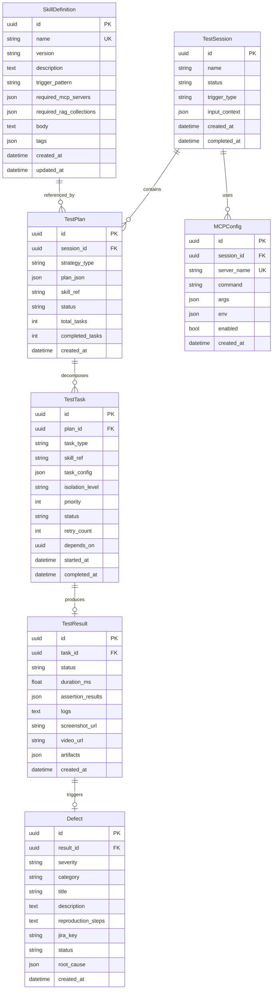

# TestAgent 技术设计文档（TDD）

> **文档版本**：v1.0
> **撰写日期**：2026-04-26
> **文档状态**：待评审
> **关联 PRD**：TestAgent_PRD.md v1.0

---

## 1. 架构决策记录（ADR）

### ADR-001：Agent Runtime 框架选型

| 维度 | 方案 A：自研轻量 Agent Loop | 方案 B：LangGraph | 方案 C：CrewAI |
|------|---------------------------|-------------------|----------------|
| **核心思路** | 参照 Claude Code 的 `while stop_reason == "tool_use"` 模式，用 Python 原生 async 实现轻量 ReAct Loop | 基于 LangChain 的有向图状态机，通过 Node/Edge 编排 Agent 流程 | 基于角色定义的多 Agent 框架，内置任务分配和协作流程 |
| **优势** | 零依赖膨胀；完全可控；测试领域可深度定制；循环体永远不变（Claude Code 核心设计原则） | 可视化流程编排；内置 checkpoint 和持久化；社区生态丰富 | 开箱即用的多 Agent 协作；角色定义直观 |
| **劣势** | 需自建编排逻辑；开发量较大 | LangChain 依赖链过重（50+ 间接依赖）；面向通用场景，测试领域定制困难；抽象层过厚导致调试困难 | 框架锁死；无法自定义 Agent 间通信协议；角色定义模型与 PRD 三层架构不匹配 |
| **决策** | ✅ **方案 A：自研轻量 Agent Loop** | ❌ 放弃 | ❌ 放弃 |
| **理由** | PRD 明确要求"自研轻量框架"；Claude Code 证明了 30 行核心循环足以支撑复杂 Agent 系统；测试领域的上下文组装、Skill 注入、工具分发逻辑需要深度定制，通用框架反而成为束缚 |
| **借鉴来源** | **Claude Code `s01_agent_loop.py` 的 `agent_loop()` 函数**——`while True` + `stop_reason != "tool_use"` 单退出条件循环，循环体本身永远不变，所有机制（工具扩展、SubAgent、压缩、团队协作）都是在循环前/后叠加的 Harness 逻辑。参见 Claude Code learn-claude-code 仓库 `agents/s01_agent_loop.py#L81-L101` |

### ADR-002：MCP Client 实现方案

| 维度 | 方案 A：MCP Python SDK 官方实现 + Gateway 代理 | 方案 B：直接 HTTP 调用 MCP Server | 方案 C：自研 RPC 协议 |
|------|-----------------------------------------------|----------------------------------|---------------------|
| **核心思路** | 使用 Anthropic 官方 `mcp` Python SDK，每个 MCP Server 作为独立 stdio 子进程启动，Gateway 统一管理生命周期和路由 | 直接用 httpx 调用 MCP Server 的 HTTP 端点 | 自定义 RPC 协议，基于 gRPC 或 JSON-RPC |
| **优势** | 与 Claude Code 生态完全兼容；官方维护；stdio 通信安全（无网络暴露）；Server 注册即用 | 简单直接；无需 SDK 依赖 | 性能最优；类型安全 |
| **劣势** | stdio 模式下 Gateway 需管理大量子进程 | 不符合 MCP 标准规范；无法复用 Claude Code 社区 MCP Server | 与 MCP 生态不兼容；开发量大 |
| **决策** | ✅ **方案 A** | ❌ 放弃 | ❌ 放弃 |
| **理由** | PRD 第 2.3.1 节明确要求"统一测试工具接入标准，解耦 Agent 与工具实现"；MCP SDK 是 Anthropic 官方维护的标准化方案；stdio 模式天然安全，Server 崩溃不影响 Gateway |
| **借鉴来源** | **Claude Code 的 MCP Client 实现**——通过 `~/.claude/mcp.json` 配置文件注册 Server，启动时为每个 Server 启动独立子进程，调用 `server.list_tools()` 获取工具列表合入 `TOOLS` 数组，工具调用通过 stdio JSON-RPC 分发。参见 learn-claude-code 仓库 `skills/mcp-builder/SKILL.md#L32-L71` 的 Server 模板和 `s02_tool_use.py#L94-L100` 的 `TOOL_HANDLERS` 分发模式 |

### ADR-003：RAG Pipeline 架构

| 维度 | 方案 A：混合检索（向量 + BM25 + RRF 融合） | 方案 B：纯向量检索 | 方案 C：使用 LlamaIndex 框架 |
|------|------------------------------------------|-------------------|---------------------------|
| **核心思路** | 双路召回：Embedding 向量检索（语义）+ BM25 关键词检索（精确），Reciprocal Rank Fusion 融合排序 | 仅使用 Embedding 向量相似度检索 | 使用 LlamaIndex 的 RAG 框架，内置检索链 |
| **优势** | 语义+精确双保障；RRF 融合排序无需调参；PRD 明确要求混合检索 | 实现最简单；语义理解能力强 | 开箱即用；支持多种检索策略 |
| **劣势** | 需维护双索引；存储开销较大 | 关键词精确匹配能力弱；测试场景中 API 路径、类名等精确匹配至关重要 | 框架锁死；定制困难；依赖链重 |
| **决策** | ✅ **方案 A** | ❌ 放弃 | ❌ 放弃 |
| **理由** | PRD 第 2.3.2 节明确要求"向量 + 关键词的混合检索"；测试场景中 API Endpoint 路径（如 `/api/v2/orders`）、类名（如 `OrderService`）等精确匹配是刚需，纯向量检索无法保证；RRF 融合排序是业界验证的成熟方案 |
| **借鉴来源** | **OpenClaw QMD（Query Memory Database）的混合检索实现**——双路召回架构：Embedding 向量 ANN 搜索 + BM25 关键词检索，通过 Reciprocal Rank Fusion 融合排序。QMD 对外暴露统一 `query()` 接口，内部协调 `VectorStore`、`FullTextSearch`、`RRFFusion` 三个子系统。参见 OpenClaw 架构中的 `qmd/engine.py`、`qmd/vector_store.py`、`qmd/fulltext.py`、`qmd/fusion.py` |

### ADR-004：Harness 隔离方案

| 维度 | 方案 A：三级隔离（Docker / MicroVM / 本地进程） | 方案 B：纯 Docker 隔离 | 方案 C：Kubernetes Pod 隔离 |
|------|-----------------------------------------------|----------------------|---------------------------|
| **核心思路** | 根据测试类型和安全需求动态选择隔离级别：API/Web 用 Docker Container，App 测试用 MicroVM，开发调试用本地进程 | 所有测试统一在 Docker Container 中执行 | 使用 K8s Pod 作为隔离单元 |
| **优势** | 安全性与资源开销平衡；开发体验好（本地进程零开销）；与 PRD 完全对齐 | 实现简单；生态成熟 | 企业级编排；自动扩缩容 |
| **劣势** | 三种 Runner 实现和切换逻辑较复杂 | App 测试场景隔离不足（需设备模拟器）；开发体验差（每次启动容器耗时） | 本地部署 K8s 过重；MVP 阶段不必要 |
| **决策** | ✅ **方案 A** | ❌ 放弃 | ❌ 放弃 |
| **理由** | PRD 第 2.3.4 节明确要求三级隔离；API/Web 测试用 Docker 足够安全且轻量；App 测试需要更强的隔离（设备模拟器）；本地进程模式是开发者刚需；V1.0 增加 MicroVM 即可 |
| **借鉴来源** | **OpenClaw 三层安全 Shell 执行机制**——容器/虚拟机/宿主三层隔离，`HarnessOrchestrator` 根据任务类型和安全配置综合决策隔离级别，通过 `SandboxFactory` 创建对应 Sandbox 实例（`DockerSandbox` / `MicroVMSandbox` / `LocalProcessRunner`）。参见 OpenClaw 的 `HarnessOrchestrator` 和 Strategy Pattern 隔离级别切换逻辑 |

### ADR-005：任务调度方案

| 维度 | 方案 A：Celery + Redis | 方案 B：Python asyncio.Queue | 方案 C：Temporal |
|------|----------------------|---------------------------|-----------------|
| **核心思路** | Celery 作为分布式任务队列，Redis 作为 Broker 和 Result Backend，支持重试、定时、链式任务 | 纯 Python async 队列，进程内调度 | 使用 Temporal 工作流引擎 |
| **优势** | Python 生态标准；分布式天然支持；PRD 推荐选型；重试/超时/优先级队列开箱即用 | 零依赖；延迟最低 | 持久化工作流；可视化；强一致性 |
| **劣势** | Redis 额外依赖；部署复杂度略高 | 不支持分布式；进程崩溃任务丢失；无持久化 | 学习曲线陡；本地部署重；Python SDK 不够成熟 |
| **决策** | ✅ **方案 A** | ❌ 放弃 | ❌ 放弃 |
| **理由** | PRD 第 5.1 节推荐 Celery + Redis；MVP 需要任务持久化（F-E05 断点续跑）；V1.0 需要分布式执行（F-E02 10 路并行）；asyncio.Queue 无法满足可靠性需求 |
| **借鉴来源** | **Claude Code 的 TaskManager + BackgroundManager 设计**——[s_full.py] 的 `TaskManager`（`s_full.py#L262-L325`）实现文件持久化任务 CRUD + DAG 依赖图，`BackgroundManager`（`s_full.py#L328-L361`）实现后台线程执行 + 通知队列。TestAgent 用 Celery 替代线程模型，但保留了 TaskManager 的 DAG 依赖排序和 BackgroundManager 的通知机制设计 |

### ADR-006：数据存储方案

| 维度 | 方案 A：SQLite(MVP) → PostgreSQL(V1.0) | 方案 B：MongoDB | 方案 C：纯 PostgreSQL |
|------|---------------------------------------|----------------|---------------------|
| **核心思路** | MVP 用 SQLite 嵌入式零配置，V1.0 迁移 PostgreSQL 支持并发和结构化索引 | 文档型数据库，Schema 灵活 | 一开始就用 PostgreSQL |
| **优势** | MVP 零运维；迁移路径清晰；PRD 推荐选型 | 灵活 Schema；适合半结构化测试结果 | 功能最全；无需迁移 |
| **劣势** | V1.0 需数据迁移；SQLite 不支持并发写入 | 缺陷结构化查询能力弱；中文全文检索需额外配置 | MVP 阶段需额外部署；本地开发体验差 |
| **决策** | ✅ **方案 A** | ❌ 放弃 | ❌ 放弃 |
| **理由** | PRD 第 5.1 节推荐 SQLite→PostgreSQL 渐进方案；MVP 追求零配置部署；PostgreSQL 的结构化索引对缺陷多维检索（严重度、模块、频率）至关重要；使用 SQLAlchemy ORM 可实现平滑迁移 |
| **借鉴来源** | **Claude Code 的文件持久化模式**——[s_full.py] 的 `TaskManager` 使用 `.tasks/task_*.json` 文件持久化任务数据，启动时从文件恢复状态。TestAgent MVP 阶段用 SQLite 替代文件存储，但保留了"启动时从持久化恢复状态"的设计理念 |

---

## 2. 技术栈明细

### 2.1 前端层

| 技术 | 选型理由 | PRD 功能映射 | 替代方案及放弃原因 |
|------|---------|-------------|------------------|
| React 18 + TypeScript | 组件化开发；类型安全；国内团队熟悉度高 | F-UI: Web Dashboard（V1.0） | Vue 3：团队 React 经验更深 |
| Ant Design 5.x | 企业级 UI 组件库；表单/表格/图表组件丰富 | F-UI: 测试大盘、执行历史 | MUI：中文生态弱 |
| ECharts 5 | 质量图表能力强（折线图/热力图/统计卡片） | F-A04: 质量趋势分析 | D3.js：开发成本过高 |
| Vite | 开发体验好；HMR 快 | - | Webpack：构建慢 |

> **MVP 说明**：前端层仅在 V1.0 交付，MVP 以 CLI 为主交互入口（PRD 第 4.1 节）。

### 2.2 后端层

| 技术 | 选型理由 | PRD 功能映射 | 替代方案及放弃原因 |
|------|---------|-------------|------------------|
| Python 3.12+ | AI/ML 生态最成熟；Playwright/Appium Python SDK 完善 | 全部后端功能 | Go：AI 生态弱；TypeScript：测试框架 SDK 不如 Python |
| FastAPI | 异步高性能；自动 OpenAPI 文档；类型安全 | F-E04: API Gateway 路由 | Flask：无原生 async；Django：过重 |
| Celery 5.x + Redis 7.x | Python 生态标准分布式任务队列；重试/超时/链式任务 | F-E02: 并行执行引擎；F-E05: 失败重试 | Dramatiq：社区小；RQ：功能弱 |
| SQLAlchemy 2.x + Alembic | ORM + 迁移工具；SQLite→PostgreSQL 平滑迁移 | 全部数据模型 | Django ORM：绑定 Django |
| Typer + Rich | 类型安全 CLI + 美观输出 | F-CLI: CLI 交互模式 | Click：类型推断弱；argparse：功能弱 |

### 2.3 Agent 层

| 技术 | 选型理由 | PRD 功能映射 | 替代方案及放弃原因 |
|------|---------|-------------|------------------|
| 自研 Agent Loop | 30 行核心循环 + 可深度定制；与 PRD 三层架构匹配 | F-P03: 测试计划编排；多 Agent 协作 | LangGraph：过重；CrewAI：框架锁死 |
| OpenAI API (GPT-4o) | 综合能力最强 LLM | 全部 LLM 驱动功能 | Claude API：MCP 生态兼容性待验证 |
| MCP Python SDK | Anthropic 官方维护；stdio 通信安全 | F-G01~G03: MCP Server 调用 | 自研协议：与生态不兼容 |
| bge-large-zh-v1.5 | 中文 embedding 效果优秀；本地部署满足数据隐私 | F-P01/P02: RAG 检索 | OpenAI embedding：API 依赖 |

### 2.4 RAG 层

| 技术 | 选型理由 | PRD 功能映射 | 替代方案及放弃原因 |
|------|---------|-------------|------------------|
| ChromaDB（MVP） | 嵌入式零配置；Python 原生 | F-P01: RAG 向量索引 | Milvus：MVP 阶段部署重 |
| Milvus（V1.0） | 分布式向量数据库；支持十亿级向量 | V1.0 规模扩展 | Pinecone：云服务，不满足本地部署 |
| Meilisearch | 轻量全文检索；中文分词支持好；API 友好 | F-P01: BM25 关键词检索 | Elasticsearch：过重；Meilisearch 足够 |
| text-embedding-3-small | API 稳定；兼容性好 | RAG embedding（API 模式） | Cohere：中文弱 |

### 2.5 执行层

| 技术 | 选型理由 | PRD 功能映射 | 替代方案及放弃原因 |
|------|---------|-------------|------------------|
| Docker + Docker Compose | 生态成熟；MVP 足够 | F-E01: Harness 沙箱执行（Level 1） | Podman：兼容性待验证 |
| Firecracker（V1.0） | 内核级隔离；启动快（<125ms） | F-E01: MicroVM 隔离（Level 2，V1.0） | gVisor：性能差 |
| Playwright (Python) | 微软维护；跨浏览器；内置自动等待 | F-G02: Web UI 测试 | Selenium：API 过时 |
| Appium 2.x (Python) | 行业标准；跨平台 | F-G03: App 测试（V1.0） | Espresso/XCTest：平台绑定 |
| httpx + jsonschema | 异步高性能；Schema 验证原生 | F-G01: API 测试 | requests：同步阻塞 |

### 2.6 基础设施

| 技术 | 选型理由 | PRD 功能映射 | 替代方案及放弃原因 |
|------|---------|-------------|------------------|
| SQLite（MVP） | 嵌入式零配置 | 全部数据存储 | PostgreSQL：MVP 不需 |
| PostgreSQL（V1.0） | 结构化索引；并发写入 | V1.0 缺陷多维检索 | MySQL：JSON 支持弱 |
| Redis 7.x | 任务队列 Broker + 缓存 + 会话存储 | F-E02: 任务队列；F-E04: WebSocket 会话 | Memcached：无持久化 |
| GitHub Actions | 覆盖最主流 CI/CD | F-CI: CI/CD 集成 | GitLab CI：客户覆盖面窄 |
| MinIO / Local FS | Artifact 存储（截图/视频/报告） | F-E01: Artifact Store | S3：本地部署不适用 |

---

## 3. 项目目录结构

```
testagent/
├── pyproject.toml                    # 项目元数据 + 依赖声明
├── alembic.ini                       # 数据库迁移配置
├── alembic/                          # 数据库迁移脚本
│   └── versions/                     # 迁移版本文件
├── testagent/                        # 主包
│   ├── __init__.py
│   ├── __main__.py                   # CLI 入口点
│   │
│   ├── gateway/                      # TestGateway 模块
│   │   ├── __init__.py
│   │   ├── app.py                    # FastAPI 应用实例 + 生命周期
│   │   ├── router.py                 # RESTful 路由定义
│   │   ├── websocket.py              # WebSocket 会话管理 + 事件推送
│   │   ├── session.py                # Session 生命周期管理
│   │   ├── mcp_registry.py           # MCP Server 注册发现 + 健康检查
│   │   ├── mcp_router.py             # MCP 工具调用路由 + 审计日志
│   │   └── middleware.py             # 认证/限流/错误处理中间件
│   │
│   ├── agent/                        # Agent Runtime 模块
│   │   ├── __init__.py
│   │   ├── loop.py                   # 核心 ReAct Loop（while stop_reason）
│   │   ├── context.py                # 上下文组装器（AGENTS/SOUL/TOOLS/MEMORY）
│   │   ├── planner.py                # Planner Agent 实现
│   │   ├── executor.py               # Executor Agent 实现
│   │   ├── analyzer.py               # Analyzer Agent 实现
│   │   ├── protocol.py               # Agent 间消息协议定义
│   │   └── todo.py                   # TodoManager（任务追踪）
│   │
│   ├── mcp_servers/                  # MCP Server 实现
│   │   ├── __init__.py
│   │   ├── base.py                   # MCP Server 基类 + 工具注册装饰器
│   │   ├── playwright_server/        # Playwright MCP Server
│   │   │   ├── __init__.py
│   │   │   ├── server.py             # Server 实例 + 工具定义
│   │   │   └── tools.py              # browser_navigate/click/screenshot/assert
│   │   ├── api_server/               # API MCP Server
│   │   │   ├── __init__.py
│   │   │   ├── server.py
│   │   │   └── tools.py              # api_request/validate_schema/compare_response
│   │   ├── jira_server/              # Jira MCP Server
│   │   │   ├── __init__.py
│   │   │   ├── server.py
│   │   │   └── tools.py              # jira_create/search/update_issue
│   │   ├── git_server/               # Git MCP Server
│   │   │   ├── __init__.py
│   │   │   ├── server.py
│   │   │   └── tools.py              # git_diff/blame/log
│   │   └── database_server/          # Database MCP Server
│   │       ├── __init__.py
│   │       ├── server.py
│   │       └── tools.py              # db_query/seed/cleanup
│   │
│   ├── rag/                          # RAG Pipeline 模块
│   │   ├── __init__.py
│   │   ├── pipeline.py               # RAG 主流水线（摄入→检索→重排）
│   │   ├── ingestion.py              # 文档摄入 + 分块
│   │   ├── embedding.py              # Embedding 服务（bge/OpenAI 双模式）
│   │   ├── vector_store.py           # 向量索引（ChromaDB/Milvus 适配）
│   │   ├── fulltext.py               # BM25 全文检索（Meilisearch 适配）
│   │   ├── fusion.py                 # RRF 融合排序
│   │   ├── reranker.py               # Cross-Encoder 重排序
│   │   └── collections.py            # Collection 配置管理
│   │
│   ├── harness/                      # Harness 执行引擎模块
│   │   ├── __init__.py
│   │   ├── orchestrator.py           # 任务调度 + 资源管理 + 隔离决策
│   │   ├── sandbox_factory.py        # 根据 isolation_level 创建 Sandbox
│   │   ├── docker_sandbox.py         # Docker Container 级隔离
│   │   ├── local_runner.py           # 本地进程执行（开发模式）
│   │   ├── microvm_sandbox.py        # MicroVM 隔离（V1.0）
│   │   ├── runners/                  # Runner 插件
│   │   │   ├── __init__.py
│   │   │   ├── base.py               # IRunner 抽象类
│   │   │   ├── playwright_runner.py  # Web 测试 Runner
│   │   │   ├── http_runner.py        # API 测试 Runner
│   │   │   └── appium_runner.py      # App 测试 Runner（V1.0）
│   │   ├── snapshot.py               # 执行快照 + 断点续跑
│   │   └── resource.py               # 资源配额管理
│   │
│   ├── skills/                       # Skill Engine 模块
│   │   ├── __init__.py
│   │   ├── loader.py                 # Skill 扫描 + 加载（SkillLoader）
│   │   ├── parser.py                 # YAML Front Matter + Markdown Body 解析
│   │   ├── validator.py              # Schema 校验 + 依赖检查
│   │   ├── registry.py               # Skill 注册表（name/trigger/tags 索引）
│   │   ├── matcher.py                # Skill 匹配引擎（trigger → skill）
│   │   └── executor.py               # Skill 执行器
│   │
│   ├── models/                       # 数据模型（SQLAlchemy）
│   │   ├── __init__.py
│   │   ├── base.py                   # BaseModel + 通用 Mixin
│   │   ├── session.py                # TestSession 模型
│   │   ├── plan.py                   # TestPlan / TestTask 模型
│   │   ├── result.py                 # TestResult 模型
│   │   ├── defect.py                 # Defect 模型
│   │   ├── skill.py                  # SkillDefinition 模型
│   │   └── mcp_config.py             # MCPConfig 模型
│   │
│   ├── db/                           # 数据库访问层
│   │   ├── __init__.py
│   │   ├── engine.py                 # Engine 创建 + 连接池
│   │   ├── repository.py            # 通用 Repository 模式
│   │   └── migrations.py            # 迁移辅助工具
│   │
│   ├── llm/                          # LLM Provider 抽象层
│   │   ├── __init__.py
│   │   ├── base.py                   # ILLMProvider 接口
│   │   ├── openai_provider.py        # OpenAI GPT-4o
│   │   └── local_provider.py         # Ollama/Qwen 本地模型
│   │
│   ├── cli/                          # CLI 交互层
│   │   ├── __init__.py
│   │   ├── main.py                   # Typer App 入口
│   │   ├── run_cmd.py                # testagent run 命令
│   │   ├── chat_cmd.py               # testagent chat 命令
│   │   ├── skill_cmd.py              # testagent skill 命令组
│   │   ├── mcp_cmd.py                # testagent mcp 命令组
│   │   ├── rag_cmd.py                # testagent rag 命令
│   │   └── output.py                 # Rich 格式化输出
│   │
│   ├── config/                       # 配置管理
│   │   ├── __init__.py
│   │   ├── settings.py               # Pydantic Settings（环境变量 + .env）
│   │   └── defaults.py               # 默认配置常量
│   │
│   └── common/                       # 公共工具
│       ├── __init__.py
│       ├── logging.py                # 结构化日志
│       ├── errors.py                 # 统一异常体系
│       └── security.py               # API Key 加密 + 数据脱敏
│
├── skills/                           # Skill Markdown 文件（Git 管理）
│   ├── api_smoke_test/
│   │   └── SKILL.md
│   ├── api_regression_test/
│   │   └── SKILL.md
│   ├── web_smoke_test/
│   │   └── SKILL.md
│   └── app_smoke_test/
│       └── SKILL.md
│
├── configs/                          # 配置文件模板
│   ├── mcp.json.template             # MCP Server 注册模板
│   └── rag_config.yaml.template      # RAG Collection 配置模板
│
├── tests/                            # 测试
│   ├── unit/                         # 单元测试
│   ├── integration/                  # 集成测试
│   └── e2e/                          # 端到端测试
│
└── docker/                           # Docker 相关
    ├── Dockerfile.harness            # Harness 沙箱镜像
    ├── Dockerfile.api_runner         # API Runner 镜像
    └── Dockerfile.web_runner         # Web Runner 镜像（含 Chromium）
```

> **设计说明**：目录结构严格体现了 Agent / MCP / RAG / Skills / Harness 五大模块的代码边界。每个模块有独立顶层目录，模块间通过 `protocol.py` / `base.py` 定义的接口通信，不直接引用内部实现。借鉴了 Claude Code 的模块解耦模式（CLI/Agent/Tools 三层隔离）和 OpenClaw 的 Markdown 文件与代码分离模式（`skills/` 目录存放 Skill 定义，`testagent/skills/` 存放 Skill Engine 代码）。

---

## 4. 数据模型设计

### 4.1 ER 图



### 4.2 核心实体字段明细

#### TestSession

| 字段名 | 类型 | 约束 | PRD 功能映射 |
|--------|------|------|-------------|
| id | UUID | PK | 全局唯一标识 |
| name | VARCHAR(255) | NOT NULL | 用户可读名称 |
| status | ENUM(pending, planning, executing, analyzing, completed, failed) | NOT NULL | F-P03: 会话状态机 |
| trigger_type | ENUM(manual, ci_push, ci_pr, scheduled) | NOT NULL | F-CI: 触发来源 |
| input_context | JSON | | F-P01: 需求文本/URL/代码变更 |
| created_at | DATETIME | NOT NULL | 审计追溯 |
| completed_at | DATETIME | | 审计追溯 |

#### TestPlan

| 字段名 | 类型 | 约束 | PRD 功能映射 |
|--------|------|------|-------------|
| id | UUID | PK | |
| session_id | UUID | FK → TestSession | |
| strategy_type | ENUM(smoke, regression, exploratory, incremental) | NOT NULL | F-P02: 测试策略类型 |
| plan_json | JSON | NOT NULL | F-P03: JSON 格式测试计划 |
| skill_ref | VARCHAR(255) | FK → SkillDefinition.name | F-P02: 关联 Skill |
| status | ENUM(pending, in_progress, completed, failed) | NOT NULL | |
| total_tasks | INTEGER | DEFAULT 0 | |
| completed_tasks | INTEGER | DEFAULT 0 | |
| created_at | DATETIME | NOT NULL | |

#### TestTask

| 字段名 | 类型 | 约束 | PRD 功能映射 |
|--------|------|------|-------------|
| id | UUID | PK | |
| plan_id | UUID | FK → TestPlan | |
| task_type | ENUM(api_test, web_test, app_test) | NOT NULL | F-G01~G03: 测试类型 |
| skill_ref | VARCHAR(255) | | F-Skill: 关联 Skill |
| task_config | JSON | NOT NULL | 执行配置（URL/Endpoint/断言等） |
| isolation_level | ENUM(docker, microvm, local) | DEFAULT 'docker' | F-E01: 隔离级别 |
| priority | INTEGER | DEFAULT 0 | F-P03: 优先级排序 |
| status | ENUM(queued, running, passed, failed, flaky, skipped, retrying) | NOT NULL | F-E05: 重试状态 |
| retry_count | INTEGER | DEFAULT 0 | F-E05: 重试次数 |
| depends_on | UUID | FK → TestTask (self) | F-P03: DAG 依赖 |
| started_at | DATETIME | | |
| completed_at | DATETIME | | |

#### TestResult

| 字段名 | 类型 | 约束 | PRD 功能映射 |
|--------|------|------|-------------|
| id | UUID | PK | |
| task_id | UUID | FK → TestTask, UNIQUE | |
| status | ENUM(passed, failed, error, flaky) | NOT NULL | F-A01: 失败分类 |
| duration_ms | FLOAT | | 性能指标 |
| assertion_results | JSON | | F-G04: 断言结果明细 |
| logs | TEXT | | F-E01: 执行日志 |
| screenshot_url | VARCHAR(512) | | F-E01: 截图 Artifact |
| video_url | VARCHAR(512) | | F-E01: 视频 Artifact |
| artifacts | JSON | | Artifact 元数据 |
| created_at | DATETIME | NOT NULL | |

#### Defect

| 字段名 | 类型 | 约束 | PRD 功能映射 |
|--------|------|------|-------------|
| id | UUID | PK | |
| result_id | UUID | FK → TestResult | |
| severity | ENUM(critical, major, minor, trivial) | NOT NULL | F-D03: 严重度评估 |
| category | ENUM(bug, flaky, environment, configuration) | NOT NULL | F-A01: 失败分类 |
| title | VARCHAR(512) | NOT NULL | F-D01: 缺陷标题 |
| description | TEXT | | F-D01: 缺陷描述 |
| reproduction_steps | TEXT | | F-D01: 复现步骤 |
| jira_key | VARCHAR(64) | UK | F-D01: Jira 关联 |
| status | ENUM(open, confirmed, resolved, closed) | DEFAULT 'open' | F-D01: 缺陷状态 |
| root_cause | JSON | | F-A02: 根因链 |
| created_at | DATETIME | NOT NULL | |

### 4.3 MVP 与 V1.0 模型差异

| 差异项 | MVP（SQLite） | V1.0（PostgreSQL） |
|--------|--------------|-------------------|
| 日期类型 | DATETIME（字符串） | TIMESTAMPTZ（原生时区） |
| JSON 字段 | JSON1 Extension | JSONB（原生二进制 JSON，支持索引） |
| 并发写入 | 单写者 + WAL 模式 | 多写者 + 行级锁 |
| 全文检索 | FTS5 Extension | pg_trgm + ts_vector |
| 缺陷多维检索 | LIKE + JSON path | GIN 索引 + 结构化查询 |
| 连接池 | 无（单连接） | SQLAlchemy AsyncSession Pool |
| 迁移工具 | Alembic | Alembic |

---

## 5. 核心模块详细设计

### 5.1 TestGateway 模块

#### 借鉴来源

**OpenClaw Gateway 的中心化消息路由架构**——Gateway 作为所有消息、工具调用、记忆检索的枢纽，通过 Mediator Pattern 实现 Agent 间解耦通信，SessionManager 管理 WebSocket 连接生命周期，MCPRouter 实现服务发现和负载均衡。

#### 核心接口定义

```python
class ITestGateway(Protocol):
    async def submit_request(self, request: TestRequest) -> str: ...
    async def get_session(self, session_id: str) -> TestSession: ...
    async def subscribe_events(self, session_id: str) -> AsyncIterator[GatewayEvent]: ...
    async def call_mcp_tool(self, server: str, tool: str, args: dict) -> Any: ...
    async def list_mcp_servers(self) -> list[MCPServerInfo]: ...

class ISessionManager(Protocol):
    async def create_session(self, trigger: TriggerType, context: dict) -> str: ...
    async def get_connection(self, session_id: str) -> WebSocket: ...
    async def broadcast(self, session_id: str, event: GatewayEvent) -> None: ...
    async def heartbeat(self, session_id: str) -> bool: ...
```

#### 关键流程伪代码

```
submit_request(request):
    1. 验证请求参数 + 认证
    2. 创建 TestSession → session_id
    3. 将 request 入队 TaskQueue (Celery)
    4. 返回 session_id

WebSocket 事件推送流程:
    session_manager.create_session() → session_id
    while session.active:
        event = event_bus.poll(session_id, timeout=5s)
        if event:
            ws.send(event.to_json())
        if !session_manager.heartbeat(session_id):
            session_manager.reconnect_or_cleanup()

MCP 工具调用路由:
    call_mcp_tool(server_name, tool_name, args):
        1. mcp_registry.lookup(server_name) → MCPConnection
        2. 验证 tool_name 在 server.tools 中
        3. 审计日志记录 (who, when, what, args)
        4. connection.call_tool(tool_name, args) → result
        5. 审计日志记录 (result_summary)
        6. 返回 result
```

#### 错误处理策略

| 错误场景 | 处理策略 | PRD 映射 |
|---------|---------|---------|
| MCP Server 不可达 | 重试 3 次（2s 退避）→ 标记 Server 为 unhealthy → 返回降级响应 | 6.3 可靠性 |
| WebSocket 断连 | 自动重连 + 会话状态持久化到 Redis → 重连后恢复 | F-E04 |
| 任务队列满 | 返回 503 + 预估等待时间 → 支持优先级排队 | F-E02 |
| 认证失败 | 返回 401 + 明确错误信息 → 限速 5 次/分钟 | 6.2 安全 |

### 5.2 Agent Runtime 模块

#### 借鉴来源

**Claude Code `s01_agent_loop.py` 的 `agent_loop()` 函数**——`while True` + `stop_reason != "tool_use"` 单退出条件循环，循环体本身永远不变；**OpenClaw Agent Runtime 的上下文组装策略**——AGENTS.md / SOUL.md / TOOLS.md / MEMORY.md 四层 Markdown 定义体系，通过 Builder Pattern 分步组装到 System Prompt 中。

#### 核心接口定义

```python
class IAgentLoop(Protocol):
    async def run(self, messages: list[Message], tools: list[Tool], system: str) -> list[Message]: ...

class IContextAssembler(Protocol):
    async def assemble(self, agent_type: AgentType, session: TestSession) -> AssembledContext: ...

class IAgent(Protocol):
    async def execute(self, task: AgentTask) -> AgentResult: ...

@dataclass
class AssembledContext:
    system_prompt: str
    tools: list[Tool]
    rag_context: list[str]
    skill_hints: list[SkillHint]
```

#### ReAct Loop 核心实现

```python
async def agent_loop(
    messages: list[dict],
    tools: list[dict],
    system: str,
    max_rounds: int = 50,
    token_threshold: int = 100000,
) -> list[dict]:
    rounds_without_todo = 0
    for _ in range(max_rounds):
        # 前置：上下文压缩
        microcompact(messages)
        if estimate_tokens(messages) > token_threshold:
            messages[:] = auto_compact(messages)

        # 前置：排空后台通知
        notifs = bg_manager.drain()
        if notifs:
            messages.append({"role": "user", "content": format_notifs(notifs)})

        # 核心 LLM 调用
        response = await llm_provider.chat(
            system=system, messages=messages, tools=tools
        )
        messages.append({"role": "assistant", "content": response.content})

        # 退出条件：模型决定不再调用工具
        if response.stop_reason != "tool_use":
            return messages

        # 执行工具调用
        tool_results = []
        for block in response.content:
            if block.type == "tool_use":
                result = await dispatch_tool(block.name, block.input)
                tool_results.append({
                    "type": "tool_result",
                    "tool_use_id": block.id,
                    "content": result,
                })
        messages.append({"role": "user", "content": tool_results})

    return messages
```

#### 上下文组装策略

```
assemble(agent_type, session):
    1. 加载 AGENTS.md → "You are {agent_type} Agent, your role is..."
    2. 加载 SOUL.md → 行为准则 + 决策偏好
    3. 加载 TOOLS.md → 可用 MCP 工具列表（从 MCP Registry 动态解析）
    4. RAG 上下文检索 → 检索相关历史策略/缺陷/测试结果
    5. Skill Layer 1 注入 → 可用 Skill 名称 + 短描述（~100 tokens/skill）
    6. 组装 system_prompt = [AGENTS] + [SOUL] + [TOOLS] + [SKILL_HINTS]
    7. 组装 rag_context = [RAG 检索结果]
    8. 返回 AssembledContext
```

> **关键设计**：借鉴 Claude Code SubAgent 的上下文隔离机制——每个 Agent 以空 `messages=[]` 启动，只有分配的 task prompt 作为第一条消息，完全隔离。Agent 间通过 Gateway 的结构化消息协议通信，不共享消息历史。参见 Claude Code `s04_subagent.py#L118-L136`。

#### 三种 Agent 的工具集分配

| Agent | 工具集 | 上下文窗口 | 借鉴来源 |
|-------|-------|-----------|---------|
| Planner Agent | MCP: Jira, Git; Skill: 策略类; RAG: 需求库+缺陷库 | 128K | Claude Code SubAgent Agent Types 注册表（`s_full.py#L160-L195`），不同 Agent 类型获得不同工具集 |
| Executor Agent | MCP: Playwright, API; Skill: 测试类; Harness Runner | 32K | 同上，Executor 类似 Claude Code 的 "code" 类型 SubAgent（全工具集） |
| Analyzer Agent | MCP: Jira, Git; Skill: 分析类; RAG: 缺陷库+失败模式库 | 64K | 同上，Analyzer 类似 "plan" 类型 SubAgent（只读 + 分析工具） |

### 5.3 RAG Pipeline 模块

#### 借鉴来源

**OpenClaw QMD（Query Memory Database）的混合检索实现**——双路召回架构，`EmbeddingService` 向量化 → `VectorStore` ANN 搜索 + `FullTextSearch` BM25 检索 → `RRFFusion` 融合排序，QMD 对外暴露统一 `query()` 接口（Facade Pattern）。

#### 核心接口定义

```python
class IRAGPipeline(Protocol):
    async def ingest(self, source: str, collection: str, metadata: dict) -> int: ...
    async def query(self, query_text: str, collection: str, top_k: int = 5, filters: dict = None) -> list[RAGResult]: ...
    async def delete(self, doc_ids: list[str], collection: str) -> int: ...

class IEmbeddingService(Protocol):
    async def embed(self, text: str) -> list[float]: ...
    async def embed_batch(self, texts: list[str]) -> list[list[float]]: ...

class IVectorStore(Protocol):
    async def upsert(self, docs: list[VectorDocument]) -> None: ...
    async def search(self, query_vector: list[float], top_k: int, filters: dict = None) -> list[SearchResult]: ...

class IFullTextSearch(Protocol):
    async def index(self, docs: list[TextDocument]) -> None: ...
    async def search(self, query: str, top_k: int, filters: dict = None) -> list[SearchResult]: ...
```

#### 完整流水线伪代码

```
ingest(source, collection, metadata):
    1. 文档摄入: 读取源文件（PDF/Markdown/JSON/HTML）
    2. 分块策略:
       - Markdown: 按标题层级分块（## 为边界）
       - 代码: 按函数/类分块
       - 文本: 512 tokens + 64 tokens overlap
    3. Embedding: embedding_service.embed_batch(chunks) → vectors
    4. 双路写入:
       - vector_store.upsert(chunks + vectors) → 向量索引
       - fulltext.index(chunks) → 全文索引
    5. 元数据写入 DB（文档来源、分块数、索引时间）

query(query_text, collection, top_k, filters):
    # 双路召回
    1. 向量检索路径:
       query_vector = embedding_service.embed(query_text)
       vector_results = vector_store.search(query_vector, top_k * 2, filters)

    2. 关键词检索路径:
       keyword_results = fulltext.search(query_text, top_k * 2, filters)

    # RRF 融合排序
    3. fused = rrf_fusion(vector_results, keyword_results, k=60)
       - score = Σ 1/(k + rank_i)  对每路结果按排名赋分
       - 合并同 doc_id 分数
       - 按 final_score 降序排序
       - 截取 top_k

    # 可选 Cross-Encoder 重排
    4. if len(fused) > 0 and reranker.enabled:
         fused = reranker.rerank(query_text, fused, top_k)

    5. 返回 top_k 结果
```

#### RRF 融合排序实现

```python
def rrf_fusion(
    vector_results: list[SearchResult],
    keyword_results: list[SearchResult],
    k: int = 60,
) -> list[SearchResult]:
    scores: dict[str, float] = {}
    docs: dict[str, SearchResult] = {}

    for rank, result in enumerate(vector_results):
        scores[result.doc_id] = scores.get(result.doc_id, 0) + 1.0 / (k + rank + 1)
        docs[result.doc_id] = result

    for rank, result in enumerate(keyword_results):
        scores[result.doc_id] = scores.get(result.doc_id, 0) + 1.0 / (k + rank + 1)
        docs[result.doc_id] = result

    sorted_ids = sorted(scores, key=scores.get, reverse=True)
    return [docs[doc_id] for doc_id in sorted_ids]
```

#### 错误处理策略

| 错误场景 | 处理策略 |
|---------|---------|
| Embedding 服务不可用 | 降级到纯关键词检索（BM25 only），日志告警 |
| 向量库连接失败 | 降级到纯全文检索，日志告警 |
| 分块失败（格式不支持） | 跳过该文档，记录失败原因，继续处理其他文档 |
| 检索无结果 | 返回空列表 + 建议 Agent 扩大检索范围或更换关键词 |

### 5.4 Harness 执行引擎模块

#### 借鉴来源

**OpenClaw 三层安全 Shell 执行机制**——容器/虚拟机/宿主三层隔离，`HarnessOrchestrator` 根据任务类型和安全配置综合决策隔离级别，通过 `SandboxFactory`（Factory Pattern）创建对应 Sandbox 实例，Strategy Pattern 实现运行时隔离级别切换。

#### 核心接口定义

```python
class ISandbox(Protocol):
    async def create(self, config: SandboxConfig) -> str: ...      # 返回 sandbox_id
    async def execute(self, sandbox_id: str, command: str, timeout: int) -> ExecutionResult: ...
    async def get_logs(self, sandbox_id: str) -> str: ...
    async def get_artifacts(self, sandbox_id: str) -> list[Artifact]: ...
    async def destroy(self, sandbox_id: str) -> None: ...

class IRunner(Protocol):
    async def setup(self, sandbox: ISandbox, config: dict) -> None: ...
    async def execute(self, sandbox: ISandbox, test_script: str) -> TestResult: ...
    async def teardown(self, sandbox: ISandbox) -> None: ...
    async def collect_results(self, sandbox: ISandbox) -> TestResult: ...

class IOrchestrator(Protocol):
    async def dispatch(self, task: TestTask) -> str: ...            # 返回 sandbox_id
    async def get_status(self, sandbox_id: str) -> SandboxStatus: ...
    async def cancel(self, sandbox_id: str) -> None: ...
```

#### 隔离级别切换逻辑

```python
class HarnessOrchestrator:
    def decide_isolation(self, task: TestTask) -> IsolationLevel:
        # 用户显式指定
        if task.isolation_level:
            return task.isolation_level

        # 根据任务类型自动决策
        if task.task_type == "api_test":
            return IsolationLevel.DOCKER
        elif task.task_type == "web_test":
            return IsolationLevel.DOCKER
        elif task.task_type == "app_test":
            return IsolationLevel.MICROVM  # V1.0
        else:
            return IsolationLevel.DOCKER  # 默认

    async def dispatch(self, task: TestTask) -> str:
        level = self.decide_isolation(task)
        sandbox = self.sandbox_factory.create(level)
        sandbox_id = await sandbox.create(self._build_config(task, level))

        runner = self.runner_factory.get_runner(task.task_type)
        await runner.setup(sandbox, task.task_config)

        try:
            result = await runner.execute(sandbox, task.task_config["test_script"])
        except TimeoutError:
            result = TestResult(status="error", error="Execution timeout")
        finally:
            await runner.teardown(sandbox)
            collected = await runner.collect_results(sandbox)
            await sandbox.destroy(sandbox_id)

        return result
```

#### Docker 沙箱安全配置

```python
SANDBOX_SECURITY_OPTS = {
    "api_test": {
        "image": "testagent/api-runner:latest",
        "security_opt": ["no-new-privileges"],
        "read_only": True,
        "mem_limit": "512m",
        "cpus": 1,
        "network_mode": "bridge",
        "timeout": 60,
    },
    "web_test": {
        "image": "testagent/web-runner:latest",
        "security_opt": ["no-new-privileges"],
        "read_only": True,
        "mem_limit": "2g",
        "cpus": 2,
        "network_mode": "bridge",
        "timeout": 120,
    },
}
```

#### 错误处理策略

| 错误场景 | 处理策略 | PRD 映射 |
|---------|---------|---------|
| 沙箱创建失败 | 重试 2 次 → 降级到本地进程（仅开发模式）→ 标记任务失败 | F-E01 |
| 执行超时 | 强制终止容器 → 收集已产生日志 → 标记 timeout | F-E01 |
| 资源不足（OOM） | 记录资源使用 → 调整配额 → 加入队列等待 | F-E02 |
| Runner 异常 | teardown 确保清理 → 收集错误日志 → 重试 1 次 | F-E05 |

### 5.5 Skill Engine 模块

#### 借鉴来源

**Claude Code `s05_skill_loading.py` 的两层注入架构**——Layer 1 将 Skill 名称 + 短描述（~100 tokens/skill）写入系统提示，Layer 2 在模型调用 `load_skill()` 时通过 `tool_result` 注入完整 Skill 正文（~2000 tokens），避免 system prompt 膨胀；**OpenClaw 的 Markdown Skills 定义**——YAML Front Matter 定义元数据，Markdown Body 定义操作知识。

#### 核心接口定义

```python
class ISkillLoader(Protocol):
    def scan(self, skills_dir: Path) -> list[RawSkill]: ...
    def parse(self, raw: RawSkill) -> SkillDefinition: ...
    def validate(self, skill: SkillDefinition) -> ValidationResult: ...

class ISkillRegistry(Protocol):
    def register(self, skill: SkillDefinition) -> None: ...
    def get_by_name(self, name: str) -> SkillDefinition: ...
    def match_by_trigger(self, text: str) -> list[SkillDefinition]: ...
    def get_descriptions(self) -> str: ...
    def get_content(self, name: str) -> str: ...

class ISkillExecutor(Protocol):
    async def execute(self, skill: SkillDefinition, context: SkillContext) -> SkillResult: ...
```

#### Skills 全流程伪代码

```
启动时 Skill 加载:
    1. SkillLoader.scan("skills/") → 遍历 */SKILL.md
    2. 对每个 SKILL.md:
       a. MarkdownParser.parse(content)
          - 提取 YAML Front Matter: name, version, description, tags, trigger,
            required_mcp_servers, required_rag_collections
          - 提取 Markdown Body: 目标、操作流程、断言策略、失败处理
       b. SkillValidator.validate(skill_def)
          - 检查必填字段: name, version, description
          - 检查 required_mcp_servers 是否在 MCPRegistry 中注册
          - 检查 required_rag_collections 是否存在
          - 检查 trigger 模式合法性
       c. SkillRegistry.register(skill_def)
          - name+version 为唯一键
          - 建立 trigger → skill 触发映射
          - 建立 tags → skill 标签索引

Layer 1 注入（系统提示）:
    SkillRegistry.get_descriptions() →
    """
    Available Skills:
      - api_smoke_test: API 冒烟测试技能，覆盖核心 Endpoint 的正向验证
      - web_smoke_test: Web 页面冒烟测试，验证核心流程可用性
    """

Layer 2 按需加载（tool_result）:
    当 LLM 调用 load_skill("api_smoke_test"):
    SkillRegistry.get_content("api_smoke_test") →
    "<skill name=\"api_smoke_test\">
     ## 目标
     在 5 分钟内验证所有核心 API Endpoint 的可用性。
     ## 操作流程
     1. 从 API MCP Server 获取所有 Endpoint 列表
     2. 按优先级排序...
     ## 断言策略
     - HTTP 状态码必须为 2xx
     ...
     </skill>"

Skill 匹配流程:
    当用户输入 "帮我跑一次 API 冒烟测试":
    1. SkillMatcher.match("API 冒烟测试") →
       - trigger 模式匹配: "冒烟测试" → [api_smoke_test, web_smoke_test]
       - 关键词权重: "API" → api_smoke_test 加权
       - 返回: api_smoke_test (score: 0.95)
    2. Planner Agent 加载 Skill → 生成测试计划
```

#### Skill Markdown 解析实现

```python
class MarkdownParser:
    FRONTMATTER_PATTERN = re.compile(r"^---\n(.*?)\n---\n(.*)", re.DOTALL)

    def parse(self, content: str) -> tuple[dict, str]:
        match = self.FRONTMATTER_PATTERN.match(content)
        if not match:
            raise SkillParseError("Missing YAML frontmatter")
        meta = yaml.safe_load(match.group(1))
        body = match.group(2).strip()
        return meta, body
```

#### 错误处理策略

| 错误场景 | 处理策略 |
|---------|---------|
| SKILL.md 格式错误 | 跳过该 Skill + 日志告警 + 列出解析失败原因 |
| required_mcp_servers 未注册 | 注册为 "degraded" 状态 + 告警 + 运行时降级（跳过该 MCP 工具） |
| Skill 循环依赖 | 检测循环 → 拒绝注册 + 错误提示 |
| Skill 执行异常 | 捕获异常 → 记录执行日志 → 标记 Skill 为 failed → 继续（不阻塞其他任务） |

---

## 6. 关键技术难点与解决方案

### 难点 1：LLM 长上下文管理

| 维度 | 内容 |
|------|------|
| **难点描述** | Planner Agent 使用 128K 上下文窗口，但当需求文档长、历史检索结果多时，上下文可能溢出；Executor Agent 执行多步骤测试时消息累积迅速 |
| **风险等级** | P0 |
| **影响功能** | F-P01（需求解析）、F-P02（策略生成）、F-E03（自愈执行） |
| **解决方案** | 借鉴 Claude Code 三层压缩策略（[s_full.py]）：(1) **microcompact**：每轮循环后自动移除冗余空白和工具调用的冗余输出；(2) **auto_compact**：token 超过阈值时，用 LLM 对历史消息生成摘要替换原文；(3) **identity re-injection**：压缩后如果 messages 过短，重新注入 Agent 身份块防止"忘记自己是谁" |
| **兜底策略** | 极端情况下截断最早的消息，保留最近 50 轮 + 系统提示 + 当前任务描述；降级到本地短上下文模型（Qwen2.5-7B） |

### 难点 2：MCP Server 崩溃恢复

| 维度 | 内容 |
|------|------|
| **难点描述** | MCP Server 作为独立子进程运行，可能因内存泄漏、网络异常、被测应用崩溃等原因宕机，导致正在执行的测试任务中断 |
| **风险等级** | P0 |
| **影响功能** | F-E01（沙箱执行）、F-G01~G03（测试生成） |
| **解决方案** | (1) **健康检查**：Gateway 每 30s 对 MCP Server 执行 heartbeat（`server.ping()`），连续 3 次失败标记 unhealthy；(2) **自动重启**：标记 unhealthy 后自动拉起，最多 3 次，超限标记不可用并通知用户；(3) **优雅降级**：不可用的 Server 从 `TOOLS` 数组移除，Agent 不再调用其工具 |
| **兜底策略** | 全部同类型 MCP Server 不可用时（如所有 Playwright Server 宕机），暂停相关任务，通知用户手动干预，记录中断点供恢复 |

### 难点 3：RAG 检索精度

| 维度 | 内容 |
|------|------|
| **难点描述** | 测试场景对检索精度要求高——失败的根因分析需要精确匹配历史缺陷模式，而非模糊语义关联。纯向量检索可能返回语义相关但实质不匹配的结果 |
| **风险等级** | P1 |
| **影响功能** | F-A01（失败分类）、F-E03（自愈执行）、F-P02（策略生成） |
| **解决方案** | (1) **混合检索**：向量检索（语义）+ BM25 关键词检索（精确），RRF 融合排序，保证 API 路径、类名等精确匹配；(2) **结构化过滤**：检索时附加 metadata filters（模块、严重度、时间范围），缩小检索空间；(3) **Cross-Encoder 重排**：对 RRF Top-20 结果用 Cross-Encoder 精排，提升相关性 |
| **兜底策略** | 检索 Top-5 结果无高置信匹配时，Agent 自主判断是否扩大检索范围或放弃 RAG 上下文，直接基于 LLM 知识推理 |

### 难点 4：沙箱资源泄漏

| 维度 | 内容 |
|------|------|
| **难点描述** | Docker 容器/镜像未及时清理导致磁盘占满；长时间运行的测试任务导致内存泄漏；并行执行时资源竞争导致 OOM |
| **风险等级** | P1 |
| **影响功能** | F-E01（沙箱执行）、F-E02（并行执行） |
| **解决方案** | (1) **强制超时**：所有沙箱设置硬超时（API 60s、Web 120s、App 180s），超时后强制 `docker kill`；(2) **资源配额**：cgroups 限制 CPU/内存，防止单任务耗尽资源；(3) **定期清理**：每 10 分钟扫描 exited 容器 + dangling 镜像，自动 `docker rm` / `docker rmi`；(4) **资源监控**：实时监控 Docker daemon 磁盘/内存使用，超过 80% 阈值时暂停新任务创建 |
| **兜底策略** | 磁盘超过 90% 时紧急清理所有非活跃容器 + 告警；内存不足时杀掉最久未活动的容器 |

### 难点 5：Agent 间通信可靠性

| 维度 | 内容 |
|------|------|
| **难点描述** | Planner→Executor→Analyzer 三层 Agent 通过 Gateway 中转消息，任何一环的消息丢失或乱序都会导致测试流程中断或结果不一致 |
| **风险等级** | P1 |
| **影响功能** | F-P03（计划编排）、F-E02（并行执行）、F-A01（失败分类） |
| **解决方案** | (1) **消息持久化**：所有 Agent 间消息写入 Redis Stream（append-only），保证至少一次投递；(2) **幂等处理**：消息携带 `message_id`，接收方去重，防止重复执行；(3) **超时重传**：发送方 30s 未收到 ACK 则重发，最多 3 次；(4) **状态机校验**：Gateway 校验消息顺序是否符合 Session 状态机（planning → executing → analyzing），拒绝乱序消息 |
| **兜底策略** | 消息重传 3 次仍失败 → 标记目标 Agent 为 unreachable → 暂停该 Session → 通知用户 + 保存断点快照 |

### 难点 6：并发测试结果一致性

| 维度 | 内容 |
|------|------|
| **难点描述** | 多个 Executor Agent 并行执行测试时，共享测试数据可能被并发修改（如数据库记录），导致测试结果不确定（flaky） |
| **风险等级** | P2 |
| **影响功能** | F-E02（并行执行）、F-E05（失败重试）、F-A01（失败分类） |
| **解决方案** | (1) **数据隔离**：每个 Executor Agent 在独立数据库 schema/database 中运行，用后即焚；(2) **依赖排序**：TestTask 的 DAG 依赖确保有数据依赖的任务串行执行；(3) **快照隔离**：数据库使用 SNAPSHOT ISOLATION 级别，防止脏读 |
| **兜底策略** | 并行执行结果不一致时，自动串行重试该任务，对比结果；仍然不一致则标记为 flaky，通知 Analyzer 分析 |

### 难点 7：LLM API 限流与成本控制

| 维度 | 内容 |
|------|------|
| **难点描述** | GPT-4o API 有 RPM/TPM 限制，多 Agent 并发调用时容易触发 429 限流；大量 LLM 调用导致成本不可控 |
| **风险等级** | P2 |
| **影响功能** | 全部 LLM 驱动功能 |
| **解决方案** | (1) **令牌桶限流**：LLM Provider 层实现令牌桶算法，控制 RPM/TPM；(2) **优先级队列**：Planner Agent 优先级最高，Executor 次之，Analyzer 最低；(3) **本地模型降级**：429 限流时自动降级到本地模型（Qwen2.5 via Ollama），非关键推理任务（如失败分类）优先使用本地模型；(4) **成本监控**：实时统计 Token 用量，设置日预算上限，超限告警 |
| **兜底策略** | 预算耗尽后暂停所有非关键 LLM 调用，仅保留 Planner Agent 的核心规划功能，其他 Agent 使用缓存结果或规则引擎 |

---

## 7. 接口契约

### 7.1 TestGateway API 路由表

#### RESTful API

| 方法 | 路径 | 描述 | 请求体 | 响应 | PRD 映射 |
|------|------|------|--------|------|---------|
| POST | `/api/v1/sessions` | 创建测试会话 | `{trigger_type, input_context, skill_ref?}` | `{session_id, status}` | F-P03 |
| GET | `/api/v1/sessions/{id}` | 获取会话详情 | - | `{session}` | F-E04 |
| GET | `/api/v1/sessions/{id}/plans` | 获取测试计划 | - | `{plans[]}` | F-P03 |
| GET | `/api/v1/sessions/{id}/results` | 获取测试结果 | - | `{results[]}` | F-A01 |
| POST | `/api/v1/sessions/{id}/cancel` | 取消会话 | - | `{status}` | - |
| GET | `/api/v1/skills` | 列出可用 Skills | - | `{skills[]}` | F-Skill |
| GET | `/api/v1/skills/{name}` | 获取 Skill 详情 | - | `{skill}` | F-Skill |
| GET | `/api/v1/mcp/servers` | 列出 MCP Server | - | `{servers[]}` | F-MCP |
| POST | `/api/v1/mcp/servers` | 注册 MCP Server | `{name, command, args, env}` | `{server_id}` | F-MCP |
| GET | `/api/v1/mcp/servers/{name}/health` | 健康检查 | - | `{status}` | 6.3 |
| POST | `/api/v1/rag/index` | 触发 RAG 索引 | `{source, collection}` | `{job_id}` | F-RAG |
| POST | `/api/v1/rag/query` | RAG 检索测试 | `{query, collection, top_k}` | `{results[]}` | F-RAG |
| GET | `/api/v1/reports/{session_id}` | 获取测试报告 | - | HTML/JSON | F-A03 |

#### WebSocket 事件

| 事件方向 | 事件类型 | Payload | 描述 | PRD 映射 |
|---------|---------|---------|------|---------|
| Server→Client | `session.started` | `{session_id, timestamp}` | 会话启动 | F-E04 |
| Server→Client | `plan.generated` | `{plan_id, total_tasks, strategy}` | 计划生成 | F-P03 |
| Server→Client | `task.started` | `{task_id, task_type, agent_id}` | 任务开始 | F-E04 |
| Server→Client | `task.progress` | `{task_id, progress_pct, current_step}` | 执行进度 | F-E04 |
| Server→Client | `task.completed` | `{task_id, status, duration_ms}` | 任务完成 | F-E04 |
| Server→Client | `task.self_healing` | `{task_id, old_locator, new_locator}` | 自愈修复 | F-E03 |
| Server→Client | `result.analyzed` | `{result_id, category, root_cause?}` | 结果分析 | F-A01 |
| Server→Client | `defect.filed` | `{defect_id, jira_key, severity}` | 缺陷归档 | F-D01 |
| Server→Client | `session.completed` | `{session_id, summary, exit_code}` | 会话完成 | F-E04 |
| Client→Server | `session.cancel` | `{session_id}` | 取消会话 | - |

### 7.2 MCP Server 接口规范

#### Playwright MCP Server

| 工具名 | 参数 | 返回 | 描述 |
|--------|------|------|------|
| `browser_navigate` | `{url: str, wait_until: "load"|"domcontentloaded"}` | `{status, title, url}` | 导航到指定 URL |
| `browser_click` | `{selector: str, button: "left"|"right"}` | `{status, clicked_element}` | 点击元素 |
| `browser_type` | `{selector: str, text: str, clear: bool}` | `{status}` | 输入文本 |
| `browser_screenshot` | `{selector?: str, full_page: bool}` | `{image_base64, path}` | 截图 |
| `browser_assert` | `{selector: str, assertion: "visible"|"text"|"value", expected?: str}` | `{passed, actual}` | UI 断言 |
| `browser_get_console` | `{}` | `{logs[]}` | 获取控制台日志 |
| `browser_get_network` | `{url_pattern?: str}` | `{requests[]}` | 获取网络请求 |

| 资源 URI | 描述 |
|---------|------|
| `page://dom` | 当前页面 DOM 结构 |
| `page://console` | 控制台日志流 |
| `page://network` | 网络请求列表 |

#### API MCP Server

| 工具名 | 参数 | 返回 | 描述 |
|--------|------|------|------|
| `api_request` | `{method, url, headers?, body?, timeout?}` | `{status_code, headers, body, duration_ms}` | 发送 HTTP 请求 |
| `api_validate_schema` | `{response_body, schema_url?, schema?: dict}` | `{valid, errors[]}` | Schema 验证 |
| `api_compare_response` | `{response_a, response_b, ignore_fields?}` | `{match, diff_fields[]}` | 响应对比 |

| 资源 URI | 描述 |
|---------|------|
| `openapi://spec` | OpenAPI 规范文档 |
| `env://config` | 环境配置（base_url、auth） |

#### Jira MCP Server

| 工具名 | 参数 | 返回 | 描述 |
|--------|------|------|------|
| `jira_create_issue` | `{project, summary, description, issuetype, priority?, labels?}` | `{key, url}` | 创建缺陷 |
| `jira_search_issues` | `{jql, max_results?}` | `{issues[]}` | 搜索缺陷 |
| `jira_update_issue` | `{key, fields: dict}` | `{status}` | 更新缺陷 |

### 7.3 Agent 间消息协议

扩展 PRD 第 2.2.2 节的 JSON Schema，定义完整的消息协议：

```json
{
  "$schema": "http://json-schema.org/draft-07/schema#",
  "title": "TestAgent Message Protocol",
  "type": "object",
  "required": ["message_id", "message_type", "sender", "receiver", "session_id", "payload", "timestamp"],
  "properties": {
    "message_id": {
      "type": "string",
      "format": "uuid",
      "description": "消息唯一标识，用于幂等去重"
    },
    "message_type": {
      "type": "string",
      "enum": ["task_assignment", "result_report", "query", "notification", "ack", "error"]
    },
    "sender": {
      "type": "string",
      "pattern": "^(planner|executor_\\d+|analyzer|gateway|cli)$"
    },
    "receiver": {
      "type": "string",
      "pattern": "^(planner|executor_\\d+|analyzer|gateway|cli|broadcast)$"
    },
    "session_id": {
      "type": "string",
      "format": "uuid"
    },
    "in_reply_to": {
      "type": "string",
      "format": "uuid",
      "description": "关联的原始消息 ID，用于 ACK 和响应关联"
    },
    "payload": {
      "oneOf": [
        {
          "$ref": "#/definitions/TaskAssignmentPayload"
        },
        {
          "$ref": "#/definitions/ResultReportPayload"
        },
        {
          "$ref": "#/definitions/QueryPayload"
        },
        {
          "$ref": "#/definitions/NotificationPayload"
        }
      ]
    },
    "timestamp": {
      "type": "string",
      "format": "date-time"
    }
  },
  "definitions": {
    "TaskAssignmentPayload": {
      "type": "object",
      "required": ["task_id", "task_type", "test_config"],
      "properties": {
        "task_id": {"type": "string", "format": "uuid"},
        "task_type": {"type": "string", "enum": ["api_test", "web_test", "app_test"]},
        "test_config": {"type": "object"},
        "skill_ref": {"type": "string"},
        "context_refs": {"type": "array", "items": {"type": "string"}},
        "priority": {"type": "integer", "minimum": 0},
        "isolation_level": {"type": "string", "enum": ["docker", "microvm", "local"]},
        "retry_policy": {
          "type": "object",
          "properties": {
            "max_retries": {"type": "integer", "default": 2},
            "backoff_seconds": {"type": "array", "items": {"type": "number"}}
          }
        }
      }
    },
    "ResultReportPayload": {
      "type": "object",
      "required": ["task_id", "status"],
      "properties": {
        "task_id": {"type": "string", "format": "uuid"},
        "status": {"type": "string", "enum": ["passed", "failed", "error", "flaky"]},
        "duration_ms": {"type": "number"},
        "assertion_results": {"type": "array"},
        "logs": {"type": "string"},
        "artifacts": {"type": "object"},
        "error_detail": {"type": "string"}
      }
    },
    "QueryPayload": {
      "type": "object",
      "required": ["query_type", "query"],
      "properties": {
        "query_type": {"type": "string", "enum": ["rag_search", "skill_lookup", "status_check"]},
        "query": {"type": "object"}
      }
    },
    "NotificationPayload": {
      "type": "object",
      "required": ["notification_type", "message"],
      "properties": {
        "notification_type": {"type": "string", "enum": ["self_healing", "retry", "mcp_unavailable", "resource_warning"]},
        "message": {"type": "string"},
        "data": {"type": "object"}
      }
    }
  }
}
```

#### 消息流转示例

```
Gateway → Planner:
  {message_type: "task_assignment", sender: "gateway", receiver: "planner",
   payload: {task_id: "...", task_type: "planning", test_config: {input: "PRD text..."}}}

Planner → Gateway:
  {message_type: "result_report", sender: "planner", receiver: "gateway",
   payload: {task_id: "...", status: "passed", plan_json: {...}, total_tasks: 12}}

Gateway → Executor_1:
  {message_type: "task_assignment", sender: "gateway", receiver: "executor_1",
   payload: {task_id: "T-001", task_type: "api_test", skill_ref: "api_smoke_test",
             test_config: {...}, retry_policy: {max_retries: 2, backoff: [2, 4]}}}

Executor_1 → Gateway:
  {message_type: "result_report", sender: "executor_1", receiver: "gateway",
   payload: {task_id: "T-001", status: "failed", duration_ms: 2341,
             error_detail: "POST /api/orders returns 500"}}

Gateway → Analyzer:
  {message_type: "task_assignment", sender: "gateway", receiver: "analyzer",
   payload: {task_id: "A-001", task_type: "analysis",
             test_config: {failed_results: [...], rag_collections: ["defect_history"]}}}
```

---

## 8. MVP 实施路径

### 8.1 团队分工

| 角色 | 职责 | 主要负责模块 |
|------|------|-------------|
| 开发者 A（后端架构） | Gateway + Agent Runtime + 核心调度 | gateway/, agent/, llm/ |
| 开发者 B（执行引擎） | Harness + MCP Server + 测试执行 | harness/, mcp_servers/, skills/ |
| 开发者 C（RAG + 数据） | RAG Pipeline + 数据模型 + CLI | rag/, models/, db/, cli/ |

### 8.2 按周拆解（3人 × 12周）

#### Phase 1：基础设施搭建（Week 1-3）

| 周次 | 开发者 A | 开发者 B | 开发者 C |
|------|---------|---------|---------|
| **W1** | FastAPI 项目骨架 + 配置管理 + 日志体系 | Docker 开发环境搭建 + Harness Runner 接口设计 | SQLite 数据模型 + Alembic 迁移 + Repository 层 |
| **W2** | Gateway REST API 路由 + Session 管理 | API MCP Server 实现（httpx + jsonschema） | CLI 框架（Typer + Rich）+ `testagent init` / `run` 命令 |
| **W3** | WebSocket 事件推送 + Celery 任务队列集成 | Playwright MCP Server 实现（browser_navigate/click/screenshot/assert） | RAG 基础管线：ChromaDB 嵌入式 + 文档分块 + Embedding 服务 |

**W1-W3 交付物**：
- ✅ 可启动的 FastAPI 服务 + CLI 命令行工具
- ✅ 2 个 MCP Server（API + Playwright）可独立运行
- ✅ SQLite 数据库 + RAG 基础索引能力
- ✅ Docker 开发环境一键启动

**验收标准**：`testagent init --project demo --type api+web` 成功初始化项目；`testagent mcp add api-server` 成功注册 MCP Server

#### Phase 2：核心 Agent 能力（Week 4-6）

| 周次 | 开发者 A | 开发者 B | 开发者 C |
|------|---------|---------|---------|
| **W4** | Agent Loop 核心实现（ReAct while 循环）+ 工具分发机制 | Harness Docker 沙箱执行 + 安全隔离配置 | RAG 混合检索（BM25 + 向量）+ RRF 融合排序 |
| **W5** | Planner Agent 实现 + 上下文组装器 | Jira MCP Server + Git MCP Server | Skill Engine 基础：Loader + Parser + Registry |
| **W6** | Executor Agent 实现 + Gateway 任务分发 | HTTP Runner + Playwright Runner 实现 | Meilisearch 集成 + RAG Collection 配置化 |

**W4-W6 交付物**：
- ✅ Planner Agent 可接收需求文本生成测试计划
- ✅ Executor Agent 可在 Docker 沙箱中执行 API/Web 测试
- ✅ 4 个 MCP Server 运行 + Gateway 注册发现
- ✅ RAG 混合检索可用 + Skill 加载解析可用

**验收标准**：输入一段 API 需求文本 → Planner 生成 JSON 测试计划 → Executor 执行至少 1 个 API 测试 → 结果写回数据库

#### Phase 3：测试生成与执行（Week 7-9）

| 周次 | 开发者 A | 开发者 B | 开发者 C |
|------|---------|---------|---------|
| **W7** | F-P01 需求智能解析 + F-P02 测试策略生成 | F-G01 API 测试用例生成（OpenAPI 解析） | F-G04 断言自动生成（API 状态码 + 响应体断言） |
| **W8** | F-P03 测试计划编排（DAG 依赖）+ F-P04 风险预测 | F-G02 Web UI 测试用例生成（URL → Playwright 脚本） | F-E05 失败重试（指数退避 + 配置化重试策略） |
| **W9** | F-E02 并行执行引擎（最多 5 路） | F-E03 自愈执行（CSS→XPath→语义定位降级） | Skill 预置：api_smoke_test + web_smoke_test |

**W7-W9 交付物**：
- ✅ F-P01~P04 规划阶段功能完整
- ✅ F-G01~G02 + F-G04 生成阶段功能完整
- ✅ F-E01~E03 + E-E05 执行阶段功能完整
- ✅ 2 个预置 Skill 可运行

**验收标准**：`testagent run --skill api_smoke_test --env staging` 完整跑通 API 冒烟测试流程；`testagent run --skill web_smoke_test --url https://demo.com` 完整跑通 Web 冒烟测试流程

#### Phase 4：分析与缺陷管理（Week 10-11）

| 周次 | 开发者 A | 开发者 B | 开发者 C |
|------|---------|---------|---------|
| **W10** | Analyzer Agent 实现 + F-A01 智能失败分类 | F-D01 缺陷自动归档（Jira 集成） | F-A03 覆盖率分析（API Endpoint 覆盖率报告） |
| **W11** | Agent 协作全链路联调（Planner→Executor→Analyzer） | Database MCP Server 实现 + 测试数据隔离 | CLI 输出格式优化 + CI/CD 模式（`testagent ci`） |

**W10-W11 交付物**：
- ✅ F-A01 + F-A03 分析阶段功能完整
- ✅ F-D01 缺陷管理功能完整
- ✅ 三层 Agent 协作全链路跑通
- ✅ CI/CD 模式可用

**验收标准**：完整 E2E 流程——输入需求 → 生成计划 → 并行执行 → 失败分类 → 缺陷归档 Jira → 生成覆盖率报告

#### Phase 5：稳定性与发布（Week 12）

| 周次 | 三人协同 |
|------|---------|
| **W12** | 全链路集成测试 + 压力测试（5 路并行）+ Bug 修复 + 文档完善 + 打包发布 |

**W12 交付物**：
- ✅ MVP 功能全量验收通过
- ✅ 5 路并行执行稳定运行
- ✅ 安装包 / PyPI 发布
- ✅ README + 快速开始指南

**验收标准**：全新机器上 `pip install testagent` → `testagent init` → `testagent run --skill api_smoke_test` 5 分钟内完成首次冒烟测试

### 8.3 关键依赖路径与风险点


| 风险点 | 影响阶段 | 缓解措施 |
|--------|---------|---------|
| LLM API 限流影响开发效率 | W4-W9 | 开发阶段优先使用本地模型（Ollama + Qwen2.5）降低 API 依赖 |
| Docker 沙箱在 Windows WSL2 上兼容性问题 | W4 | 提前验证 WSL2 + Docker Desktop 集成；备选方案：直接在 WSL2 内运行 |
| Playwright MCP Server 与页面对象模型适配 | W7-W8 | W6 前完成 Playwright MCP Server 的核心工具验收 |
| RAG 检索精度不达标 | W7-W9 | W4 前完成 RAG 混合检索的精度基准测试，不达标则调整分块策略和 Embedding 模型 |
| 自愈执行（F-E03）准确率不达标 | W8 | 降级方案：仅实现 CSS→XPath 两级降级，语义定位作为增强项延后 |
| 3 人联调期间资源瓶颈 | W10-W11 | W10 前各模块完成独立单元测试 + 接口契约 Mock，减少联调阻塞 |

---

## 质量自检

- [x] **每个 ADR 是否都有 Claude Code 或 OpenClaw 的具体模块引用（而非泛泛提及"借鉴了架构思想"）？**
  - ADR-001 → Claude Code `s01_agent_loop.py#L81-L101` 的 `agent_loop()` 函数
  - ADR-002 → Claude Code `mcp-builder/SKILL.md#L32-L71` + `s02_tool_use.py#L94-L100`
  - ADR-003 → OpenClaw QMD `qmd/engine.py` + `vector_store.py` + `fulltext.py` + `fusion.py`
  - ADR-004 → OpenClaw `HarnessOrchestrator` + `SandboxFactory` 三层隔离
  - ADR-005 → Claude Code `s_full.py#L262-L361` TaskManager + BackgroundManager
  - ADR-006 → Claude Code `s_full.py` 文件持久化 TaskManager

- [x] **项目目录结构是否体现了 MCP/RAG/Skills/Harness/Agent 五个模块的清晰边界？**
  - `testagent/gateway/` → TestGateway
  - `testagent/agent/` → Agent Runtime
  - `testagent/mcp_servers/` → MCP Server 实现
  - `testagent/rag/` → RAG Pipeline
  - `testagent/harness/` → Harness 执行引擎
  - `testagent/skills/` → Skill Engine

- [x] **数据模型是否覆盖了 PRD 中所有 P0 功能的数据需求？**
  - F-P01~P03 → TestSession + TestPlan
  - F-G01~G04 → TestTask（task_type, task_config, skill_ref）
  - F-E01~E05 → TestTask（isolation_level, retry_count）+ TestResult
  - F-A01, F-A03 → TestResult（status, assertion_results）+ Defect（category, root_cause）
  - F-D01 → Defect（jira_key, severity, reproduction_steps）

- [x] **关键技术难点是否有兜底策略（而非只有理想方案）？**
  - 7 个难点均有兜底策略：截断+降级模型 / 暂停+通知 / 放弃RAG+LLM推理 / 紧急清理 / 暂停Session / 串行重试 / 仅保留核心功能

- [x] **MVP 实施路径是否可在 3 人 × 12 周内完成（有 buffer）？**
  - PRD 估算约 140 人天，3 人 × 12 周 = 约 198 人天可用，预留 58 人天（29%）buffer
  - W12 整周为稳定性 + 发布 buffer

- [x] **接口契约是否足够具体到可直接开始编码？**
  - RESTful API 13 个路由，含完整请求/响应定义
  - WebSocket 10 个事件类型，含 Payload Schema
  - MCP Server 3 个 Server 的工具 + 资源契约
  - Agent 间消息协议完整 JSON Schema（含 4 种 Payload 定义）